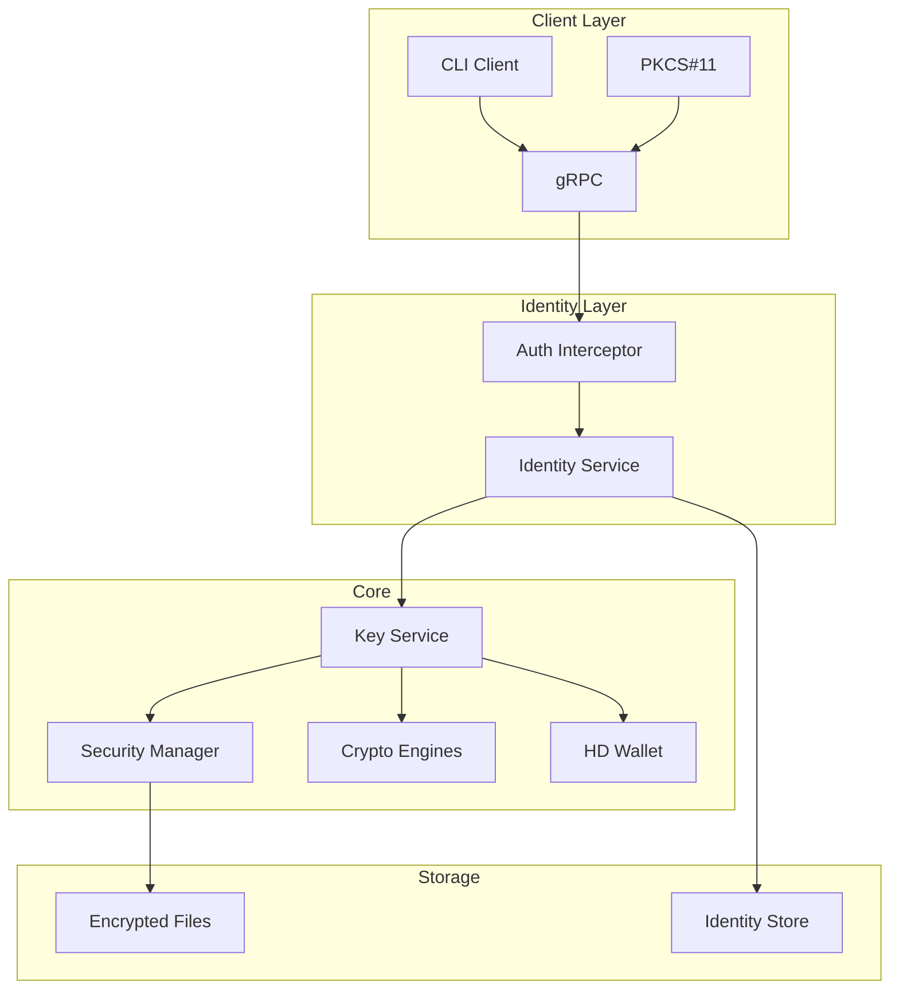

# softKMS - Modern Software Key Management System

A secure, modern alternative to SoftHSM with HD wallet support, written in Rust.

[](LICENSE)
[](https://www.rust-lang.org)

**Use Cases:** Enterprise key management, HD wallet infrastructure, PKCS#11 HSM replacement, development/testing environments.

## Why softKMS?

| Feature | SoftHSM | softKMS |
|---------|---------|---------|
| **Language** | C | Rust (memory-safe) |
| **HD Wallets** | ❌ | ✅ BIP32/44 |
| **Crypto** | Fixed (RSA/ECC) | Pluggable (Ed25519, P-256, Falcon-512, Falcon-1024) |
| **APIs** | PKCS#11 only | PKCS#11 + gRPC + CLI |
| **Deployment** | Manual | Docker + systemd |
| **Identity** | Single user | Multi-identity with isolation |

## Dependencies

- libclang-dev

## Setup

```bash
git submodule update --init --recursive
```

## 60-Second Quick Start

```bash
# Build
cargo build --release

# Start daemon
./target/release/softkms-daemon --foreground &

# Initialize with passphrase (admin)
./target/release/softkms init

# Create a client identity (for services/agents)
./target/release/softkms identity create --type ai-agent
# Token: <SAVE THIS!>

# Use token to generate keys (isolated to this identity)
./target/release/softkms --token <token> generate --algorithm ed25519 --label mykey

# Sign data
./target/release/softkms --token <token> sign --label mykey --data "Hello World"
```

## Identity-Based Access Control

softKMS uses ECC public keys for identity and provides **isolated access** between clients:

- **Admin** (passphrase): Full access to all keys
- **Clients** (token): Access only to keys they create
- **Isolation**: Each identity's keys are namespace-isolated

### Creating Identities

```bash
# Create Ed25519 identity (default, fast)
$ softkms identity create --type ai-agent --description "Trading Bot"
Public Key: ed25519:MCowBQYDK2VwAyE...
Token: <SAVE THIS - never shown again!>

# Create P-256 identity (for PKCS#11 compatibility)
$ softkms identity create --type service --key-type p256
Public Key: p256:BL5a5tD5x0vM...
Token: <SAVE THIS>
```

### Using Tokens

```bash
# Set token environment variable
export SOFTKMS_TOKEN="..."

# Or pass directly
softkms --token <token> list

# PKCS#11 (use token as PIN)
pkcs11-tool --module libsoftkms.so --login --pin "<token>" --list-keys
```

See [Identity Management](docs/IDENTITIES.md) for complete documentation.

## Key Features

- **🔐 Secure Key Storage** - AES-256-GCM encrypted at rest with PBKDF2 key derivation
- **👥 Identity Isolation** - Multi-tenant with ECC-based identities (Ed25519 default, P-256 optional)
- **🎟️ Bearer Tokens** - Simple token-based auth with ownership isolation
- **🌳 HD Wallet Support** - BIP32/BIP44 hierarchical deterministic keys (Ed25519)
- **🛡️ Post-Quantum Crypto** - Falcon-512 and Falcon-1024 signatures (NIST PQC standard)
- **🔌 Multiple APIs** - PKCS#11, gRPC, REST, and CLI interfaces
- **🚀 Modern Architecture** - Async Rust with pluggable storage backends
- **🐳 Container-Ready** - Docker and Kubernetes support
- **📊 Memory Safe** - Zeroization of sensitive data, secure memory handling

## Architecture



## Installation

### From Source

```bash
git clone https://github.com/your-org/softkms.git
cd softkms
cargo build --release

# Install binaries
sudo cp target/release/softkms-daemon /usr/local/bin/
sudo cp target/release/softkms /usr/local/bin/
```

### Docker

```bash
docker build -t softkms -f docker/Dockerfile .
docker run -p 50051:50051 softkms
```

## Documentation

- **[Usage Guide](docs/USAGE.md)** - Complete CLI, PKCS#11, and HD wallet usage
- **[Identity Management](docs/IDENTITIES.md)** - Multi-identity authentication and access control
- **[Architecture](docs/ARCHITECTURE.md)** - System design and components
- **[Security Model](docs/SECURITY.md)** - Security features and threat model
- **[API Reference](docs/API.md)** - gRPC API documentation

## Quick Commands

```bash
# Initialize daemon (admin)
softkms init

# Generate keys as admin
softkms generate --algorithm ed25519 --label mykey

# Create client identity
softkms identity create --type ai-agent

# Import HD wallet seed
softkms --token <token> import-seed --mnemonic "word1 word2 ..." --label wallet

# Derive child keys
softkms --token <token> derive --algorithm ed25519 --seed wallet --path "m/44'/283'/0'/0/0" --label derived-key

# Sign and verify
softkms --token <token> sign --label mykey --data "message"
softkms --token <token> verify --label mykey --data "message" --signature "..."

# PKCS#11 usage
pkcs11-tool --module libsoftkms.so --list-slots
pkcs11-tool --module libsoftkms.so --login --pin "<token>" --keypairgen --key-type EC:prime256v1
```

## Development

```bash
# Run tests
cargo test

# Run specific test
cargo test --test pkcs11_e2e_tests

# Build release
./build.sh
```

## Project Status

**Version:** v0.1 - Functional with Tests

**Implemented:**
- ✅ Daemon with gRPC and REST APIs
- ✅ Ed25519 and P-256 crypto engines
- ✅ Falcon-512 and Falcon-1024 post-quantum signatures
- ✅ HD wallet derivation (BIP32/44)
- ✅ PKCS#11 compatibility layer
- ✅ Encrypted file storage
- ✅ CLI client
- ✅ Multi-identity with token-based auth
- ✅ Key ownership isolation

**In Progress:**
- 🚧 REST API (skeleton)
- 🚧 WebAuthn module (skeleton)

**Future:**
- TPM2 hardware integration
- HashiCorp Vault backend
- Prometheus metrics
- Custom policies per identity

## Security

softKMS uses industry-standard security practices:

- **AES-256-GCM** for key encryption at rest
- **PBKDF2** with 210k iterations for master key derivation
- **Ed25519** and **P-256** for cryptographic operations
- **Identity Isolation** - Each client sees only their own keys
- **Secure memory** handling with automatic zeroization
- **No key export** - keys never leave the daemon
- **Audit logging** - All operations logged with identity context

See [SECURITY.md](docs/SECURITY.md) for details.

## License

AGPLv3 License - See LICENSE file

## Contributing

Contributions welcome! Please read our [Contributing Guide](CONTRIBUTING.md) (TODO).

## Support

- 📖 [Documentation](docs/)
- 🐛 [Issue Tracker](../../issues)
- 💬 [Discussions](../../discussions)

---

**Note:** softKMS is currently in active development. APIs may change until v1.0.
