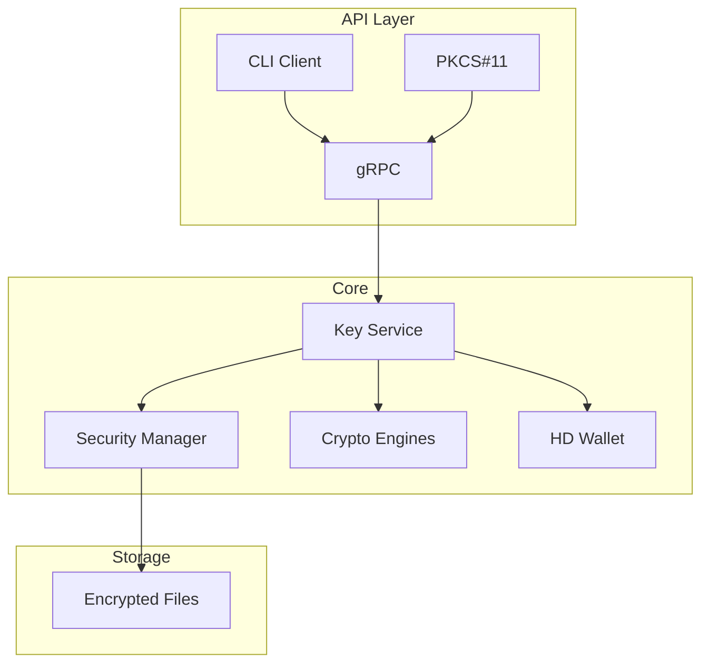

# softKMS - Modern Software Key Management System

A secure, modern alternative to SoftHSM with HD wallet support, written in Rust.

[](LICENSE)
[](https://www.rust-lang.org)

**Use Cases:** Enterprise key management, HD wallet infrastructure, PKCS#11 HSM replacement, development/testing environments.

## Why softKMS?

| Feature | SoftHSM | softKMS |
|---------|---------|---------|
| **Status** | Abandoned | Actively maintained |
| **Language** | C | Rust (memory-safe) |
| **HD Wallets** | ❌ | ✅ BIP32/44 |
| **Crypto** | Fixed (RSA/ECC) | Pluggable (Ed25519, P-256) |
| **APIs** | PKCS#11 only | PKCS#11 + gRPC + CLI |
| **Deployment** | Manual | Docker + systemd |

## 60-Second Quick Start

```bash
# Build
cargo build --release

# Start daemon
./target/release/softkms-daemon --foreground &

# Initialize with passphrase
./target/release/softkms init

# Generate a key
./target/release/softkms generate --algorithm ed25519 --label mykey

# Sign data
./target/release/softkms sign --label mykey --data "Hello World"
```

## Key Features

- **🔐 Secure Key Storage** - AES-256-GCM encrypted at rest with PBKDF2 key derivation
- **🌳 HD Wallet Support** - BIP32/BIP44 hierarchical deterministic keys (Ed25519)
- **🔌 Multiple APIs** - PKCS#11, gRPC, and CLI interfaces
- **🚀 Modern Architecture** - Async Rust with pluggable storage backends
- **🐳 Container-Ready** - Docker and Kubernetes support
- **📊 Memory Safe** - Zeroization of sensitive data, secure memory handling

## Architecture



## Installation

### From Source

```bash
git clone https://github.com/your-org/softkms.git
cd softkms
cargo build --release

# Install binaries
sudo cp target/release/softkms-daemon /usr/local/bin/
sudo cp target/release/softkms /usr/local/bin/
```

### Docker

```bash
docker build -t softkms -f docker/Dockerfile .
docker run -p 50051:50051 softkms
```

## Documentation

- **[Usage Guide](docs/USAGE.md)** - Complete CLI, PKCS#11, and HD wallet usage
- **[Architecture](docs/ARCHITECTURE.md)** - System design and components
- **[Security Model](docs/SECURITY.md)** - Security features and threat model
- **[API Reference](docs/API.md)** - gRPC API documentation

## Quick Commands

```bash
# Initialize daemon
softkms init

# Generate keys
softkms generate --algorithm ed25519 --label mykey
softkms generate --algorithm p256 --label mykey

# Import HD wallet seed
softkms import-seed --mnemonic "word1 word2 ..." --label wallet

# Derive child keys
softkms derive --seed wallet --path "m/44'/283'/0'/0/0" --label algo-key

# Sign and verify
softkms sign --label mykey --data "message"
softkms verify --label mykey --data "message" --signature "..."

# PKCS#11 usage
pkcs11-tool --module libsoftkms.so --list-slots
pkcs11-tool --module libsoftkms.so --keypairgen --key-type EC:prime256v1
```

## Development

```bash
# Run tests
cargo test

# Run specific test
cargo test --test pkcs11_e2e_tests

# Build release
./build.sh
```

## Project Status

**Version:** v0.2 - Functional with Tests

**Implemented:**
- ✅ Daemon with gRPC API
- ✅ Ed25519 and P-256 crypto engines
- ✅ HD wallet derivation (BIP32/44)
- ✅ PKCS#11 compatibility layer
- ✅ Encrypted file storage
- ✅ CLI client

**In Progress:**
- 🚧 REST API (skeleton)
- 🚧 WebAuthn module (skeleton)

**Future:**
- TPM2 hardware integration
- HashiCorp Vault backend
- Prometheus metrics
- RBAC and ephemeral tokens

## Security

softKMS uses industry-standard security practices:

- **AES-256-GCM** for key encryption at rest
- **PBKDF2** with 210k iterations for master key derivation
- **Ed25519** and **P-256** for cryptographic operations
- **Secure memory** handling with automatic zeroization
- **No key export** - keys never leave the daemon

See [SECURITY.md](docs/SECURITY.md) for details.

## License

MIT License - See LICENSE file

## Contributing

Contributions welcome! Please read our [Contributing Guide](CONTRIBUTING.md) (TODO).

## Support

- 📖 [Documentation](docs/)
- 🐛 [Issue Tracker](../../issues)
- 💬 [Discussions](../../discussions)

---

**Note:** softKMS is currently in active development. APIs may change until v1.0.
