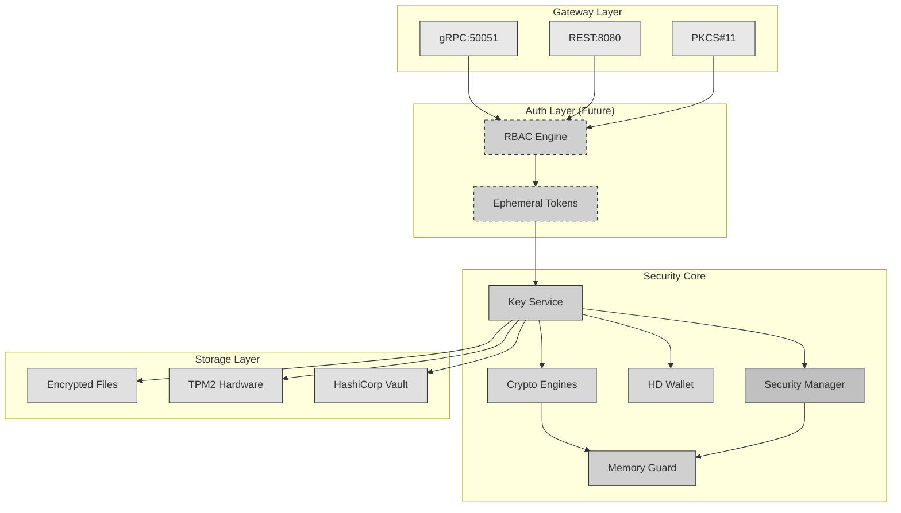

# softKMS - Modern Software Key Management System

A modern, modular, and secure alternative to SoftHSM designed for Linux systems with support for HD wallets, pluggable cryptographic schemes, and contemporary deployment patterns.

**Use Cases:**
- **Enterprise Key Management**: Secure key storage with PKCS#11, gRPC, and REST APIs
- **HD Wallet Infrastructure**: BIP32/BIP44 key derivation for cryptocurrency operations
- **Development & Testing**: Software HSM for development environments
- **Passkey Backup**: WebAuthn/FIDO2 authenticator with seed-based recovery
- **Non Human Identities**: Key management for IoT devices, microservices with ephemeral keys or credentials.

## Overview

softKMS is a software-based Key Management System (KMS) that provides:
- **Modern Architecture**: Modular design with pluggable components
- **HD Wallet Support**: Built-in hierarchical deterministic (HD) key derivation (BIP32/44)
- **Multiple APIs**: gRPC, REST, and PKCS#11 compatibility
- **Container-Native**: First-class Docker and Kubernetes support
- **Cross-Platform**: Native packages for Debian, Fedora, and other Linux distributions
- **WebAuthn Support**: *Optional* FIDO2 authenticator for Passkey backup/recovery (see below)

## Why softKMS?

### Compared to SoftHSM

| Feature | SoftHSM | softKMS |
|---------|---------|---------|
| **Status** | Abandoned | Actively maintained |
| **Architecture** | Monolithic C | Modular Rust with FFI |
| **HD Wallets** | ❌ | ✅ BIP32/44 |
| **Crypto Agility** | Fixed (RSA/ECC) | Pluggable (Lattice, etc.) |
| **APIs** | PKCS#11 only | PKCS#11 + gRPC + REST |
| **Deployment** | Manual | Docker + systemd + packages |
| **Storage** | File-only | Pluggable backends |
| **Monitoring** | Basic | Prometheus metrics |

## Architecture



> **Future (dashed)**: RBAC + Ephemeral Tokens - Same API for humans and agents, roles determine key access

**Architecture Overview:**
1. **Client Zone** - Users, applications, and agents connect via CLI, HTTP, gRPC, or PKCS#11
2. **Gateway Layer** - API entry points handle incoming requests
3. **Security Core** - Central services for key operations and protection
4. **Storage Layer** - Encrypted data persisted to files, TPM, or cloud vaults

## Core Principles

### 1. Separation of Concerns
- **API Layer**: Multiple interfaces (gRPC, REST, PKCS#11)
- **Core Engine**: Secure, isolated key operations
- **Storage Layer**: Pluggable backends (file, TPM, cloud)

### 2. Pluggable Architecture
```rust
// Example: Adding a new cryptographic scheme
trait CryptoEngine {
    fn generate_key(&self, params: KeyParams) -> Result<Key, Error>;
    fn sign(&self, key: &Key, data: &[u8]) -> Result<Signature, Error>;
    fn verify(&self, key: &Key, data: &[u8], sig: &Signature) -> Result<bool, Error>;
}

// Implement for Ed25519, ECDSA, RSA, Lattice, etc.
```

### 3. Container-First
```dockerfile
FROM scratch
COPY softkms-daemon /bin/
VOLUME ["/var/lib/softkms"]
EXPOSE 50051 8080
ENTRYPOINT ["/bin/softkms-daemon"]
```

## Features

### Current (v0.2)
- [x] Daemon architecture with startup/shutdown
- [x] gRPC API (full implementation)
- [x] CLI with all commands (generate, sign, verify, derive, init, etc.)
- [x] Ed25519 and P-256 cryptographic engines
- [x] HD wallet derivation (BIP32/44 with Peikert scheme)
- [x] Encrypted file storage (AES-256-GCM)
- [x] Security layer with master key derivation (PBKDF2)
- [x] Docker support
- [x] Deterministic key derivation for WebAuthn/Passkey support

### Planned
- [ ] REST API
- [ ] PKCS#11 FFI layer
- [ ] TPM2 integration
- [ ] HashiCorp Vault backend
- [ ] Prometheus metrics
- [ ] WebAuthn/FIDO2 authenticator (CTAP2 protocol)
- [ ] Lattice-based crypto (post-quantum)

### Future: Agent Support
- [ ] Same API for humans and agents (no separate Agent API)
- [ ] RBAC engine with roles (admin, signer, viewer, etc.)
- [ ] Ephemeral tokens for agents (TTL-based, auto-expiring)
- [ ] Role determines: which keys, which operations, max validity
- [ ] Key policies (allowed operations, timeouts)
- [ ] Audit trails for agent key usage

## Installation

### Debian/Ubuntu
```bash
apt install softkms
systemctl enable softkms
systemctl start softkms
```

### Fedora
```bash
dnf install softkms
systemctl enable softkms
systemctl start softkms
```

### Docker
```bash
docker run -d \
  -v /var/lib/softkms:/var/lib/softkms \
  -p 127.0.0.1:50051:50051 \
  ghcr.io/yourusername/softkms:latest
```

## Quick Start

### Running the Daemon

```bash
# Build first
cargo build --release

# Start the daemon (runs in background)
./scripts/softkms-start.sh

# Check if it's running
./scripts/softkms-status.sh

# Test the API
curl http://127.0.0.1:8080/health

# View logs
./scripts/softkms-logs.sh -f

# Stop the daemon
./scripts/softkms-stop.sh
```

**Data and logs are stored in `~/.softKMS/`:**
- Config: `~/.softKMS/config.toml`
- Keys: `~/.softKMS/data/`
- Logs: `~/.softKMS/logs/daemon.log`

### Running Tests

```bash
# Run all tests
cargo test

# Run with output
cargo test -- --nocapture

# Run specific test
cargo test test_daemon_creation

# Run integration tests only
cargo test --test integration

# Use the test runner script
./test_runner.sh
```

## Usage

### CLI Quick Start

```bash
# 1. Start the daemon
./target/release/softkms-daemon &

# 2. Initialize the keystore (creates master key)
./target/release/softkms init
# Enter passphrase (with confirmation by default)

# 3. Generate a key
./target/release/softkms generate --algorithm p256 --label "MyKey"

# 4. List keys
./target/release/softkms list

# 5. Sign data
./target/release/softkms sign --label "MyKey" --data "HelloWorld"

# 6. Verify signature
./target/release/softkms verify --label "MyKey" --data "HelloWorld" --signature "<base64-signature>"
```

### Initialize Keystore

Initialize the keystore with a passphrase:

```bash
# With passphrase confirmation (default)
softkms init

# Skip confirmation (for automation)
softkms init --passphrase "yourpassphrase"
```

The keystore can only be initialized once. To reinitialize, you must delete the storage directory:

```bash
rm -rf ~/.softKMS/data/*
```

### Creating Keys

Generate a new key with the specified algorithm:

```bash
# Generate P-256 key
softkms generate --algorithm p256 --label "MyKey"

# Generate Ed25519 key  
softkms generate --algorithm ed25519 --label "SignKey"
```

Supported algorithms: `p256`, `ed25519`

### Listing Keys

```bash
# List all keys
softkms list

# Output shows:
# - Key ID (UUID)
# - Algorithm (p256, ed25519)
# - Label
# - Creation timestamp
```

### Signing Data

Sign data using a key (by label or ID):

```bash
# Sign by label
softkms sign --label "MyKey" --data "data to sign"

# Sign by key ID
softkms sign --key <uuid> --data "data to sign"

# With explicit passphrase
softkms sign --label "MyKey" --data "data" --passphrase "mypass"
```

Output:
```
Signature (base64): <base64-encoded-signature>
Algorithm: p256
```

### Verifying Signatures

Verify a signature against the original data:

```bash
softkms verify --label "MyKey" --data "data to sign" --signature "<base64-signature>"
```

Output:
```
Signature: VALID
Algorithm: p256
```

### Complete Example

```bash
# Start daemon
./target/release/softkms-daemon &

# Initialize
./target/release/softkms init --passphrase "testpass"

# Generate key
./target/release/softkms generate --algorithm p256 --label "TestKey" --passphrase "testpass"

# Sign
SIGNATURE=$(./target/release/softkms sign --label "TestKey" --data "HelloWorld" --passphrase "testpass" | grep "Signature" | cut -d' ' -f3)

# Verify
./target/release/softkms verify --label "TestKey" --data "HelloWorld" --signature "$SIGNATURE"
```

### PKCS#11 Integration
```bash
# Set environment variable
export PKCS11_MODULE_PATH=/usr/lib/softkms/libsoftkms_pkcs11.so

# Use with OpenSSL
openssl req -new -x509 -keyform engine \
  -engine pkcs11 \
  -key pkcs11:object=MyKey
```

### HD Wallet
```bash
# Import seed
softkms seed import --mnemonic "twelve words ..."

# Derive child key
softkms key derive \
  --seed <seed-id> \
  --path "m/44'/283'/0'/0/0" \
  --label "Address 1"
```

## Optional: WebAuthn/Passkey Support

*Note: WebAuthn support is an optional module that can be enabled separately.*

softKMS can optionally act as a software-based FIDO2 authenticator, enabling:
- **Backup & Recovery**: Derive Passkeys from HD wallet seeds
- **Cross-Device Sync**: Same seed → same credentials on all devices
- **No Hardware Required**: Use as a security key replacement
- **Deterministic Credentials**: `derive(seed, rp_id, user_handle)` always gives same credential

### WebAuthn Setup

```bash
# Import seed for WebAuthn
softkms seed import --mnemonic "twelve words ..."

# Install browser extension manifest
softkms webauthn install-manifest

# List WebAuthn credentials
softkms webauthn list
```

### WebAuthn Browser Setup

1. **Install Browser Extension**: Add softKMS extension to Chrome/Firefox
2. **Install Native Host**: Run `softkms webauthn install-manifest`
3. **Import Seed**: Use your seed phrase to enable backup/recovery
4. **Create Passkeys**: softKMS appears as "Security Key" in WebAuthn dialogs
5. **Recovery**: On new device, import same seed → all Passkeys restored

See `docs/WEBAUTHN.md` for detailed WebAuthn documentation.

## API Reference

### gRPC
```protobuf
service KeyStore {
  rpc CreateKey(CreateKeyRequest) returns (CreateKeyResponse);
  rpc Sign(SignRequest) returns (SignResponse);
  rpc ImportSeed(ImportSeedRequest) returns (ImportSeedResponse);
  rpc DeriveKey(DeriveKeyRequest) returns (DeriveKeyResponse);
}
```

### REST
```bash
# Create key
curl -X POST http://localhost:8080/v1/keys \
  -H "Content-Type: application/json" \
  -d '{"algorithm": "ed25519", "label": "My Key"}'

# Sign data
curl -X POST http://localhost:8080/v1/keys/{key-id}/sign \
  -H "Content-Type: application/json" \
  -d '{"data": "base64-encoded-data"}'
```

## Development

### Building from Source
```bash
# Clone repository
git clone https://github.com/yourusername/softKMS
cd softKMS

# Build
cargo build --release

# Build and test
./build.sh

# Build Docker image
docker build -t softkms .
```

### Project Structure
```
softKMS/
├── src/                  # Core daemon (Rust)
│   ├── api/             # gRPC server and protobuf
│   ├── crypto/          # Cryptographic engines (Ed25519, P-256, HD)
│   ├── hd_wallet/       # HD wallet derivation (BIP32/44)
│   ├── security/        # Security layer (encryption, master key)
│   ├── storage/         # Storage backends
│   ├── key_service.rs   # Key lifecycle management
│   ├── daemon/          # Daemon startup/shutdown
│   └── webauthn/        # Optional: FIDO2/WebAuthn module (stub)
├── cli/                  # Command-line tool
├── proto/                # Protocol Buffer definitions
├── docs/                 # Documentation
├── docker/               # Docker configurations
└── pkg/                  # Packaging (deb, rpm)
```

## Security

### Threat Model
- **Trusted**: The softKMS daemon process
- **Untrusted**: Client applications, network, storage
- **Mitigations**: Process isolation, encrypted storage, memory clearing

### Security Features
- ✅ Memory protection (mlock, guard pages)
- ✅ Encrypted storage at rest (AES-GCM)
- ✅ Secure key deletion (zeroization)
- ✅ Hardware-backed storage (TPM2)
- ✅ Audit logging
- ✅ Container isolation

## License

**Copyright (c) 2024 - All Rights Reserved**

This is a proprietary project. Contributions are welcome but the codebase remains under the author's copyright.

## Contributing

Contributions are welcome! Please see [CONTRIBUTING.md](CONTRIBUTING.md) for details.

## Acknowledgments

- Inspired by SoftHSM and the need for a modern alternative
- Built with Rust for memory safety and performance
- WebAuthn implementation based on FIDO2 specifications

## Support

- GitHub Issues: https://github.com/yourusername/softKMS/issues
- Discussions: https://github.com/yourusername/softKMS/discussions
