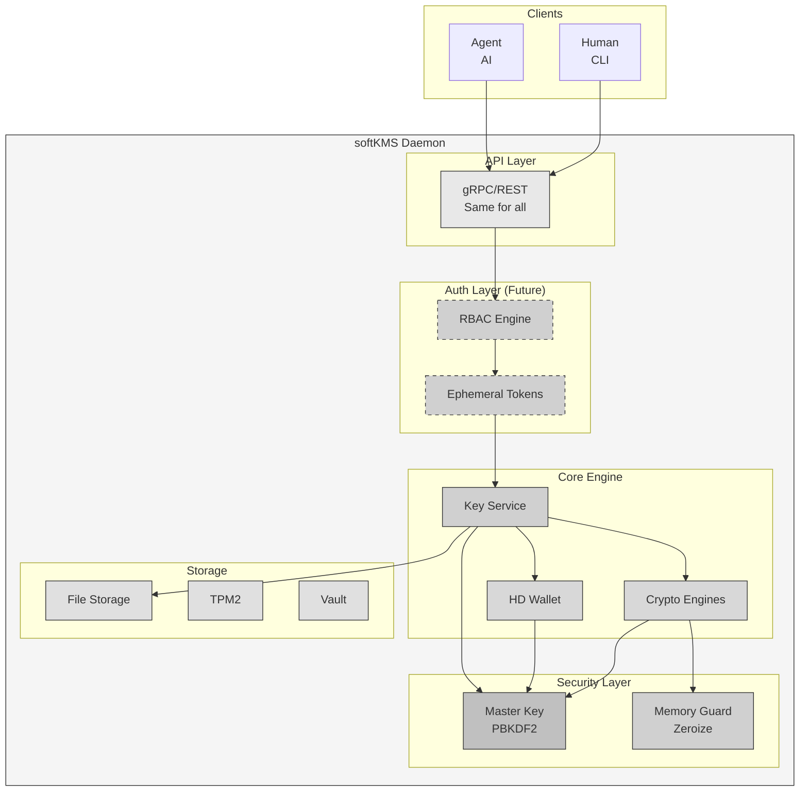
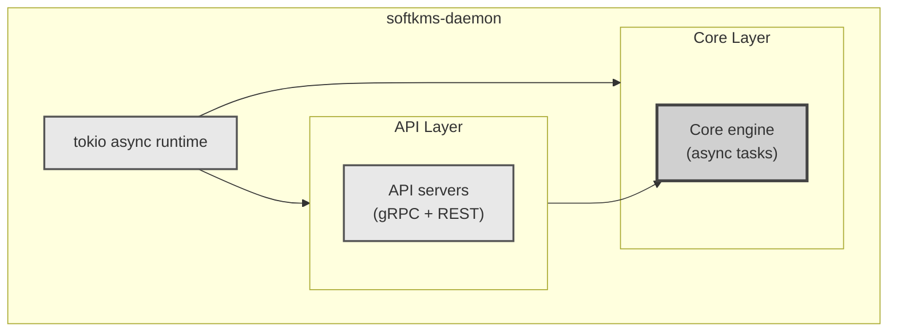
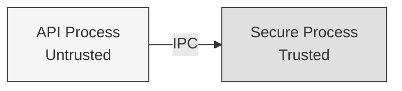
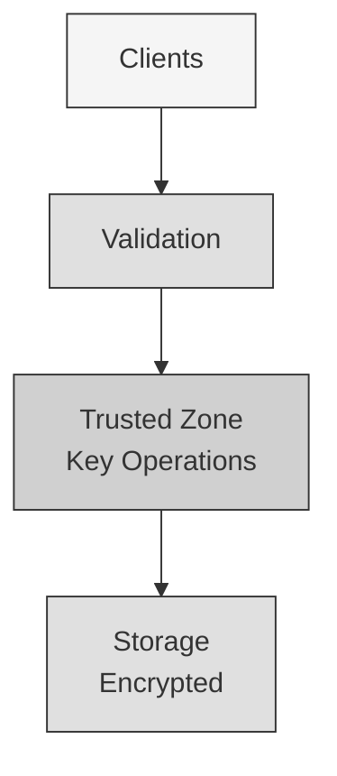

# softKMS Architecture

## Overview

softKMS is a modern, modular software key management system designed as a replacement for SoftHSM. It provides secure key storage and cryptographic operations with a focus on HD wallets, pluggable components, and contemporary deployment patterns.

## High-Level Architecture



> **Future (dashed)**: RBAC + Ephemeral Tokens - Same API for humans and agents, roles determine key access and TTLs

## Core Modules

### 1. API Layer

**Purpose**: Expose functionality to clients

**Modules**:
- `src/api/grpc.rs` - gRPC service definitions
- `src/api/rest.rs` - REST endpoints
- `src/api/mod.rs` - Common API logic

**Design Decisions**:
- Multiple APIs (gRPC for performance, REST for simplicity)
- Async/await throughout
- Request validation at API layer
- Response serialization here

**Thread Safety**: All APIs are `Send + Sync`, handled by tokio

---

### 2. Core Engine

**Purpose**: Business logic and orchestration

**Modules**:
- `src/crypto/` - Pluggable cryptographic engines
- `src/hd_wallet/` - HD wallet derivation (BIP32)
- `src/daemon/` - Main daemon logic

**Key Traits**:
```rust
// Cryptographic operations
trait CryptoEngine {
    fn generate_key(&self, params: KeyParams) -> Result<Key>;
    fn sign(&self, key: &Key, data: &[u8]) -> Result<Signature>;
}

// HD wallet
trait HDWallet {
    fn derive_child(seed: &Seed, path: &DerivationPath) -> Result<Key>;
}
```

**Design Decisions**:
- Trait-based for pluggability
- Engine selection by algorithm string ("ed25519", "ecdsa", etc.)
- HD wallet is first-class, not bolted-on
- ARC-0052 compatibility for

---

### 3. Security Layer

**Purpose**: Protect keys in memory and at rest

**Components**:
- **Master Key**: Derived from PIN/password via PBKDF2
- **Encryption**: AES-256-GCM for key data
- **Memory**: `secrecy` crate prevents accidental logging
- **Zeroization**: `zeroize` crate clears memory on drop

**Key Design**:
```rust
pub struct MasterKey {
    key: Secret<[u8; 32]>,  // Never exposed
}

impl MasterKey {
    fn from_pin(pin: &str, salt: &[u8]) -> Self {
        // PBKDF2 with 210k iterations
        let key = pbkdf2(pin, salt, 210_000, 32);
        Self { key: Secret::new(key) }
    }
}
```

**Security Guarantees**:
1. Keys never in plaintext in storage (encrypted at rest)
2. Keys cleared from memory after use (zeroize)
3. Master key never leaves Security Layer
4. Secure memory prevents swapping to disk (mlock)

---

### 4. Storage Layer

**Purpose**: Persist keys securely

**Trait**:
```rust
trait StorageBackend: Send + Sync {
    async fn store_key(&self,
        id: KeyId,
        metadata: &KeyMetadata,
        encrypted_data: &[u8],
    ) -> Result<()>;
    
    async fn retrieve_key(&self,
        id: KeyId,
    ) -> Result<Option<(KeyMetadata, Vec<u8>)>>;
    
    // ... delete, list, exists
}
```

**Implementations**:
- **FileStorage**: Encrypted files on filesystem
- **TPM2Storage**: Hardware-backed (future)
- **VaultStorage**: HashiCorp Vault (future)

**Design Decisions**:
- Pluggable backends
- Async for I/O operations
- Encrypted data only (never plaintext)
- Metadata separate from key data (for listing without decryption)

---

### 5. IPC Layer

**Purpose**: Internal communication

**Not yet implemented** - placeholder exists

**Planned**:
- Unix domain sockets
- D-Bus (optional)
- In-process (for testing)

**Use Cases**:
- Plugin system for crypto engines
- External HSM integration
- Multi-process architecture (future)

## Optional Modules

### WebAuthn/FIDO2 Authenticator

**Location**: `src/webauthn/` (optional, can be enabled/disabled)

**Purpose**: Act as a software-based FIDO2 authenticator for WebAuthn/Passkey operations

**Modules**:
- `src/webauthn/types.rs` - Core types (credential, algorithms)
- `src/webauthn/credential.rs` - Credential lifecycle management
- `src/webauthn/ctap2.rs` - CTAP2 protocol implementation
- `src/webauthn/native_messaging.rs` - Browser integration
- `src/webauthn/derivation.rs` - HD wallet credential derivation

**Key Features**:
- **FIDO2 Authenticator**: Full CTAP2 server implementation
- **Passkey Support**: Create and authenticate with passkeys
- **Deterministic Credentials**: Derive credentials from HD wallet seeds
- **Backup & Recovery**: Recover all passkeys from a seed phrase
- **Browser Integration**: Native messaging host for Chrome/Firefox

**Use Cases**:
- Backup hardware security keys (YubiKey, etc.)
- Cross-device credential sync
- Passkey recovery from seed phrase
- Development/testing WebAuthn without hardware

See `docs/WEBAUTHN.md` for detailed documentation.

## Data Structures

### Key Types

```rust
// Stored in secure storage
pub struct Key {
    pub id: KeyId,                    // UUID
    pub metadata: KeyMetadata,       // Algorithm, type, labels
    pub encrypted_data: Vec<u8>,      // AES-GCM encrypted key material
}

// In memory during operations
pub struct KeyHandle {
    pub id: KeyId,
    pub metadata: KeyMetadata,
    pub material: Secret<Vec<u8>>,  // Cleared on drop
}

// HD Wallet
pub struct Seed {
    pub id: KeyId,
    pub material: Secret<[u8; 64]>,  // Master seed
    pub metadata: KeyMetadata,
}

// Derivation
pub struct DerivationPath {
    pub components: Vec<u32>,  // e.g., [44, 283, 0, 0, 0]
}
```

### Error Handling

```rust
pub enum Error {
    Crypto(String),       // Cryptographic operation failed
    Storage(String),      // Storage I/O error
    InvalidKey(String),   // Key malformed or corrupted
    KeyNotFound(String),  // Key doesn't exist
    AccessDenied,         // Authentication failed
    Internal(String),     // Bug or unexpected error
}
```

## Process Model

### Single Process (Current)



**Advantages**:
- Simple
- Fast (no IPC overhead)
- Easy to debug
- Good for mobile/embedded

**Trade-offs**:
- No process isolation (keys in same process as API)
- Single point of failure

### Multi-Process (Future)



**Advantages**:
- Keys isolated in separate process
- API process can crash without losing keys
- Better security boundaries

**When to implement**: Post-v1.0, for high-security deployments

## Memory Safety

### Rust Guarantees

1. **No null pointer derefs**: `Option<T>` instead of null
2. **No buffer overflows**: Slice bounds checking
3. **No use-after-free**: Ownership system
4. **No data races**: `Send`/`Sync` traits
5. **Memory leaks prevented**: RAII pattern

### Cryptographic Safety

1. **Secrecy crate**: Prevents accidental logging of keys
2. **Zeroize**: Clears memory when dropped
3. **Mlock**: Prevents swapping sensitive data (when available)
4. **No clones**: Keys use `Secret<T>`, can't accidentally copy

## Security Boundaries


    style T2 fill:#c0c0c0,stroke:#333,stroke-width:3px
    style T3 fill:#c0c0c0,stroke:#333,stroke-width:3px
    style T4 fill:#d0d0d0,stroke:#444,stroke-width:2px
    style S1 fill:#e0e0e0,stroke:#666,stroke-width:2px
    style S2 fill:#e0e0e0,stroke:#666,stroke-width:2px
```

## Deployment Patterns

### Development
```bash
# Direct run
cargo run --bin softkms-daemon

# Or with config
./target/debug/softkms-daemon --config dev.toml
```

### Production (systemd)
```bash
# Install package
apt install softkms

# Configure
/etc/softkms/config.toml

# Start service
systemctl start softkms

# Check status
systemctl status softkms
```

### Docker
```bash
# Run container
docker run -d \
  -v softkms-data:/var/lib/softkms \
  -p 127.0.0.1:50051:50051 \
  ghcr.io/yourusername/softkms:latest
```

## Comparison to SoftHSM

| Aspect | SoftHSM | softKMS |
|--------|---------|---------|
| **Architecture** | Monolithic C | Modular Rust |
| **Process Model** | Library | Daemon |
| **API** | PKCS#11 | gRPC + REST + PKCS#11 |
| **HD Wallets** | No | Yes (BIP32) |
| **WebAuthn** | No | Optional (FIDO2) |
| **Crypto** | Fixed | Pluggable |
| **Memory Safety** | Manual | Rust guarantees |
| **Async** | No | Yes (tokio) |
| **Deployment** | Library link | Service |
| **Containers** | Difficult | Native |
| **Monitoring** | Basic | Prometheus |

## Performance Considerations

### Current Design
- Async I/O for storage (non-blocking)
- Zero-copy where possible
- No locks (async mutex if needed)
- Single-threaded crypto (Rust crypto libs thread-safe)

### Bottlenecks
- File I/O (use SSD)
- Encryption/decryption (hardware acceleration when available)
- Serialization (protobuf is fast)

### Scalability
- gRPC supports connection pooling
- Stateless design (easy to scale horizontally with load balancer)
- Storage backend is pluggable (can use high-performance backends)

## Future Extensibility

### Plugin System
```rust
// Crypto engine plugins
trait CryptoEnginePlugin {
    fn name(&self) -> &str;
    fn generate_key(&self, params: &[u8]) -> Result<Vec<u8>>;
    fn sign(&self, key: &[u8], data: &[u8]) -> Result<Vec<u8>>;
}
```

### Multi-Tenant
- Separate namespaces for different users
- ACLs per key
- Audit logging per tenant

### Cloud Integration
- AWS KMS backend
- Azure Key Vault backend
- Google Cloud KMS backend

## Development Guidelines

### Adding a New Crypto Engine

1. Create `src/crypto/your_engine.rs`
2. Implement `CryptoEngine` trait
3. Register in `src/crypto/mod.rs`
4. Add tests
5. Update documentation

### Adding a New Storage Backend

1. Create `src/storage/your_backend.rs`
2. Implement `StorageBackend` trait
3. Handle encryption (receive encrypted data, store as-is)
4. Register in `src/storage/mod.rs`
5. Add config options

### Adding Optional Modules

1. Create module under `src/optional/your_module/`
2. Make it conditionally compiled with feature flag
3. Keep core KMS independent
4. Document in separate file (e.g., `docs/YOUR_MODULE.md`)
5. Update main documentation with "Optional" designation

### Error Handling

- Use `thiserror` for structured errors
- Never expose internal details to clients
- Log full errors, return sanitized versions

## References

- SoftHSM source: https://github.com/opendnssec/SoftHSMv2
- PKCS#11 spec: http://docs.oasis-open.org/pkcs11/pkcs11-base/v2.40/pkcs11-base-v2.40.html
- WebAuthn spec: https://www.w3.org/TR/webauthn-2/
- CTAP2 spec: https://fidoalliance.org/specs/fido-v2.1-ps-20210615/fido-client-to-authenticator-protocol-v2.1-ps-errata-20220621.html
- FIDO2 spec: https://fidoalliance.org/specs/fido-v2.1-ps-20210615/
- ARC-0052: HD wallet spec
- BIP32: Bitcoin HD wallet spec
- BIP44: Multi-account hierarchy
