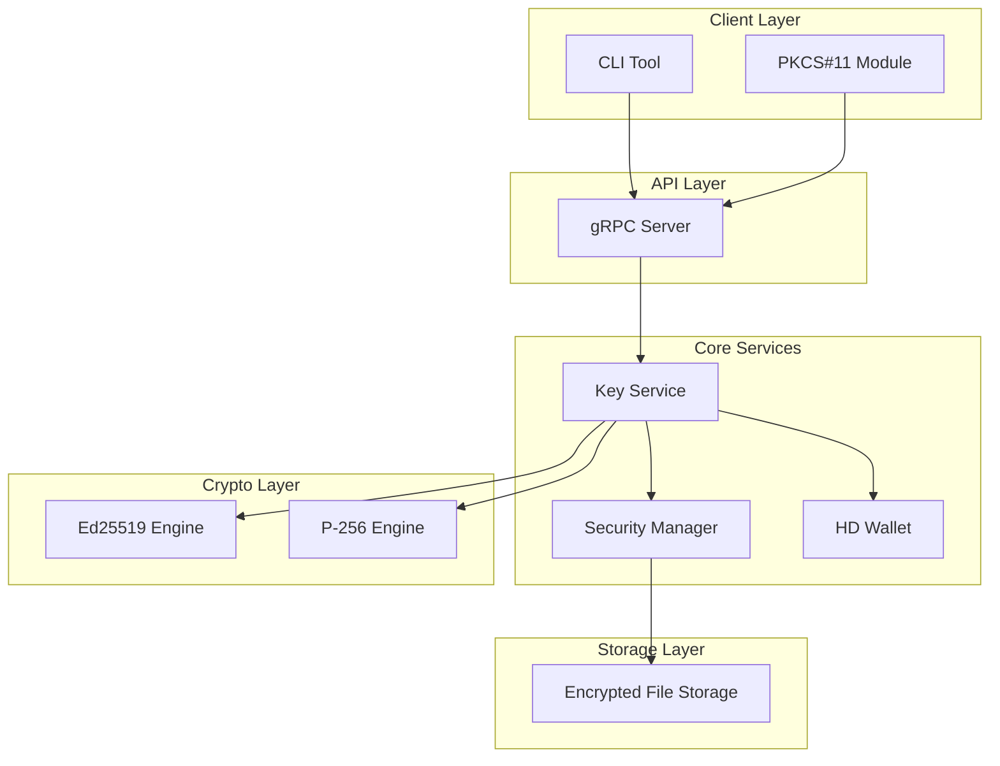
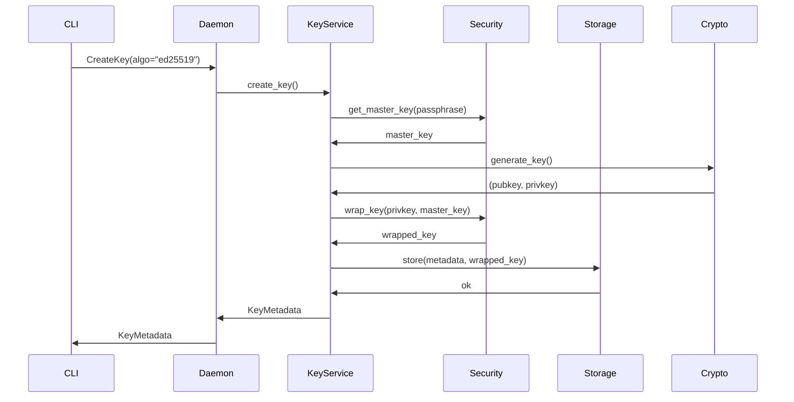
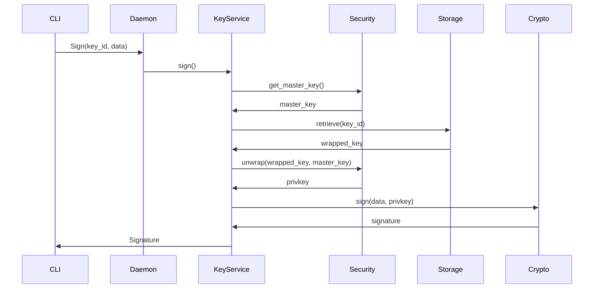

# softKMS Architecture

## Overview

softKMS is a modular software key management system written in Rust, designed as a modern replacement for SoftHSM. It provides secure key storage, cryptographic operations, and HD wallet support through multiple APIs.

## Design Principles

1. **Security First** - Memory-safe Rust, encrypted storage, secure key handling
2. **Modularity** - Pluggable storage, crypto engines, and APIs
3. **Async/Await** - Non-blocking I/O throughout
4. **Multiple Interfaces** - CLI, gRPC, REST, and PKCS#11
5. **HD Wallet Native** - Built-in BIP32/BIP44 support

## System Architecture



## Component Details

### 1. CLI Client (`cli/src/main.rs`)

The command-line interface for human interaction.

**Responsibilities:**
- Parse user commands and arguments
- Connect to daemon via gRPC
- Display formatted output
- Handle interactive prompts (init confirmation)

**Communication:**
- Uses `--server` flag to specify daemon address
- Supports local socket (default: `127.0.0.1:50051`)

**Key Commands:**
```rust
Commands::Init       // Initialize keystore
Commands::Generate   // Create new keys
Commands::List       // List all keys
Commands::Sign       // Sign data
Commands::Derive     // HD wallet derivation
Commands::Health     // Check daemon status
```

### 2. Daemon (`src/daemon/mod.rs`)

The main server process that manages keys and handles requests.

**Responsibilities:**
- Manage process lifecycle (startup/shutdown)
- Handle OS signals (SIGTERM, SIGINT)
- Maintain PID file
- Coordinate API servers
- Manage security context

**Startup Flow:**
```rust
1. Parse CLI arguments
2. Load/create storage directory
3. Initialize SecurityManager
4. Start gRPC server
5. Setup signal handlers
6. Wait for shutdown
```

**Configuration:**
- `--storage-path`: Data directory (default: `~/.softKMS/`)
- `--grpc-addr`: gRPC bind address (default: `127.0.0.1:50051`)
- `--pid-file`: PID file location
- `--foreground`: Run in foreground

### 3. API Layer (`src/api/`)

#### gRPC Server (`grpc.rs`)

Primary API using Protocol Buffers.

**Services:**
- `KeyManagement` - Create, list, delete keys
- `Signing` - Sign and verify operations
- `Health` - Status and readiness checks

**Key Operations:**
```protobuf
CreateKey(algorithm, label) -> KeyMetadata
ListKeys() -> List<KeyMetadata>
Sign(key_id, data) -> Signature
Health() -> HealthStatus
```

#### REST Server (`rest.rs`)

HTTP API for simple integrations (skeleton).

**Status**: Placeholder - not fully implemented

### 4. PKCS#11 Module (`src/pkcs11/`)

C-compatible shared library for existing PKCS#11 clients.

**Components:**
- `mod.rs` - FFI exports and function table
- `client.rs` - gRPC client for PKCS#11 operations
- `session.rs` - PKCS#11 session management

**Mechanisms Supported:**
- EC key generation (P-256)
- ECDSA signing
- Key listing via C_FindObjects

**Usage:**
```bash
pkcs11-tool --module libsoftkms.so --list-slots
```

### 5. Key Service (`src/key_service.rs`)

Core business logic for key lifecycle management.

**Responsibilities:**
- Coordinate storage operations
- Manage key metadata
- Handle crypto engine selection
- Wrap/unwrap key material

**Key Types:**
```rust
enum KeyType {
    Seed,       // BIP39 seed
    Derived,    // HD-derived key
    Imported,   // Imported raw key
}
```

### 6. Security Manager (`src/security/mod.rs`)

Central security coordinator.

**Responsibilities:**
- Master key derivation (PBKDF2)
- Passphrase validation
- Key wrapping/unwrapping
- Memory protection

**Security Flow:**
```rust
1. User provides passphrase
2. PBKDF2 derives master key (210k iterations, fixed salt)
3. Master key cached in-memory (TTL: 5 min)
4. Individual keys wrapped with master key + key-specific nonce
5. Wrapped keys stored encrypted
```

**Memory Protection:**
- Secrets use `secrecy::Secret<T>` wrapper
- Automatic zeroization on drop
- Cache with expiration

### 7. Crypto Engines (`src/crypto/`)

Pluggable cryptographic implementations.

#### Ed25519 (`ed25519.rs`)
- Signing and verification
- Key generation
- Deterministic signatures

#### P-256 (`p256.rs`)
- ECDSA operations
- NIST P-256 curve
- Used for WebAuthn/PKCS#11

#### HD Wallet (`hd_ed25519.rs`)
- BIP32 hierarchical derivation
- BIP44 path support
- Two schemes: Peikert (default) and V2

**Derivation:**
```rust
// From BIP39 seed
let xprv = XPrv::new(seed)?;

// Derive child key
let child = xprv.derive(path)?;
```

### 8. Storage Layer (`src/storage/`)

#### File Storage (`file.rs`)

Encrypted file-based storage (default).

**File Structure:**
```
~/.softKMS/
├── keys/
│   ├── <key-id>.json      # Metadata (unencrypted)
│   └── <key-id>.enc      # Encrypted key material
├── .salt                   # PBKDF2 salt
└── .verification_hash      # Passphrase verification
```

**Encryption Format:**
- Version byte (0x01)
- Nonce (12 bytes)
- Ciphertext (AES-256-GCM)
- Tag (16 bytes)

**Key Wrapper** (`security/wrapper.rs`):
- AES-256-GCM encryption
- AAD includes key metadata (prevents substitution)
- Unique nonce per operation

## Data Flow Examples

### Creating a Key



### Signing Data



## Configuration

### Daemon Configuration

```toml
[storage]
backend = "file"
path = "/var/lib/softkms"

[api]
grpc_addr = "127.0.0.1:50051"
rest_addr = "127.0.0.1:8080"

[security]
pbkdf2_iterations = 210000
```

### Environment Variables

- `SOFTKMS_DAEMON_ADDR` - Default daemon address for PKCS#11
- `HOME` - Used for default storage path

## Thread Safety

All components are designed for concurrent access:

| Component | Thread Safety |
|-----------|---------------|
| KeyService | `Arc<...>` wrapped, `Send + Sync` |
| SecurityManager | `Mutex` protected cache |
| StorageBackend | Object-safe trait |
| gRPC Server | Tokio handles concurrency |

## Security Model

### Threat Model

**Protects Against:**
- Key material exposure at rest
- Passphrase brute-force (PBKDF2)
- Memory dumps (zeroization)
- Key substitution (AAD in encryption)

**Assumes:**
- Daemon process is protected
- Passphrase is strong
- Physical storage is secure

### Key Lifecycle

```
Generation -> Wrapping -> Storage -> Retrieval -> Unwrapping -> Use -> Zeroize
```

**Master Key:**
- Derived from passphrase via PBKDF2
- Cached in memory with TTL
- Never persisted

**Individual Keys:**
- Wrapped with master key
- Stored encrypted
- Unwrapped on-demand
- Zeroized after use

## Deployment Patterns

### Development

```bash
# Single process, foreground
softkms-daemon --foreground --storage-path ./data
```

### Production (Single Host)

```bash
# Systemd service
systemctl start softkms

# Data in user home
~/.softKMS/
```

### Container

```bash
docker run -v softkms-data:/data softkms
```

## Future Extensions

- **RBAC Engine** - Role-based access control
- **Ephemeral Tokens** - Short-lived credentials
- **TPM2 Integration** - Hardware-backed storage
- **HashiCorp Vault** - External storage backend
- **REST API** - Full HTTP API
- **Prometheus Metrics** - Observability

## See Also

- [Usage Guide](USAGE.md) - Practical examples
- [Security Model](SECURITY.md) - Detailed security design
- [API Reference](API.md) - gRPC API documentation
