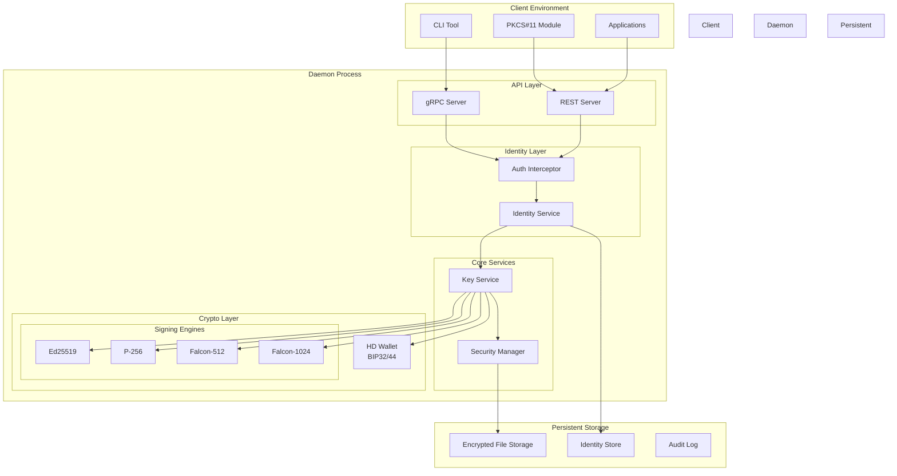
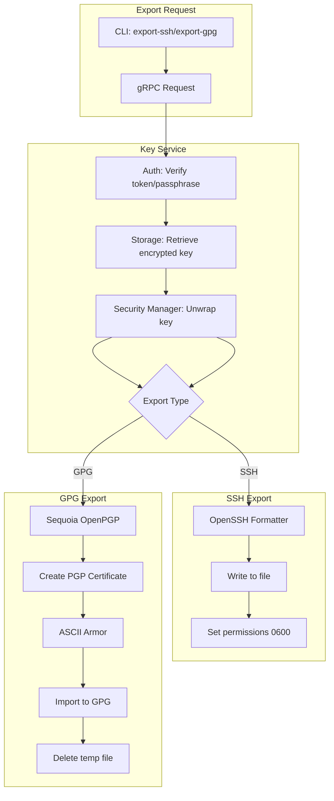
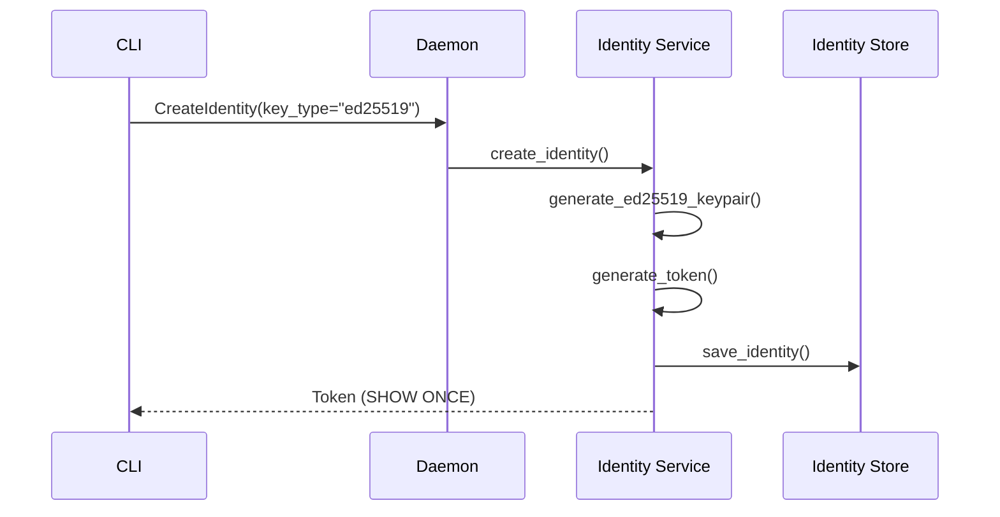
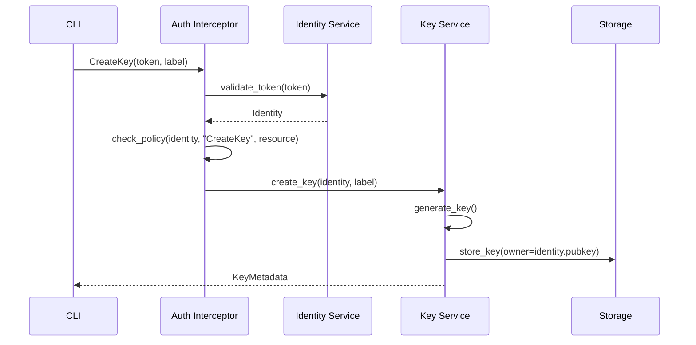
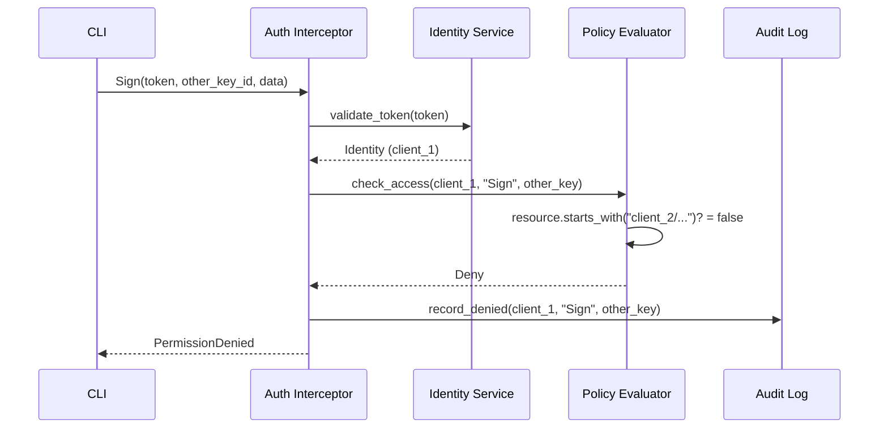

# softKMS Architecture

## Overview

softKMS is a modular software key management system written in Rust, designed as a modern replacement for SoftHSM. It provides secure key storage, cryptographic operations, and HD wallet support through multiple APIs with **identity-based access control**.

## Design Principles

1. **Security First** - Memory-safe Rust, encrypted storage, secure key handling
2. **Identity Isolation** - Multi-tenant with ECC-based identities (Ed25519 default, P-256 optional)
3. **Modularity** - Pluggable storage, crypto engines, and APIs
4. **Async/Await** - Non-blocking I/O throughout
5. **Multiple Interfaces** - CLI, gRPC, REST, and PKCS#11
6. **HD Wallet Native** - Built-in BIP32/BIP44 support

## System Architecture

softKMS runs as an isolated daemon process. **Keys never leave the daemon** - all cryptographic operations happen server-side.



**Security Boundary:**
- **Client Environment**: Untrusted code space - applications, CLI, PKCS#11 library
- **Daemon Process**: Isolated process where all key material and cryptographic operations reside
- **Persistent Storage**: Configurable storage backend (file-based, future: cloud, HSM)
- **API Layer**: Network boundary - only signatures and metadata cross
- **Keys never leave**: All signing happens inside the daemon, clients only receive signatures

## Identity-Based Access Control

softKMS implements a multi-identity architecture where:

- **Admin** (passphrase): Full access to all keys
- **Clients** (token): Isolated access to their own keys only
- **Isolation**: Each identity's keys are namespace-isolated by public key

### Identity Types

| Identity | Auth Method | Access Scope | Use Case |
|----------|-------------|--------------|----------|
| **Admin** | Passphrase | All keys | System administrator |
| **Client** | Token | Own keys only | Services, AI agents, applications |

### Token-Based Authentication

```
Client                          Server
  |                                |
  |--- Create Identity ---------->|
  |<-- Token (SAVE!) -------------|
  |                                |
  |--- Token + Operation --------->|
  |<-- Result ---------------------|
```

**Token Format:** `base64(public_key:secret)`
- Public key: Identity identifier (Ed25519 or P-256)
- Secret: Random 32-byte value
- Server stores: SHA256(secret) for validation

## Component Details

### 1. Identity Service (`src/identity/`)

**NEW** - Manages client identities and authentication.

**Responsibilities:**
- Generate ECC keypairs (Ed25519 default, P-256 optional)
- Create and validate bearer tokens
- Store identity metadata
- Map tokens to identities

**Identity Structure:**
```rust
pub struct Identity {
    pub public_key: String,        // "ed25519:MCowBQ..." or "p256:BL5a5t..."
    pub key_type: String,          // "ed25519" | "p256"
    pub token_hash: String,        // SHA256(secret)
    pub role: String,              // "client" | "admin"
    pub created_at: DateTime,
    pub is_active: bool,
}
```

**Storage:**

User mode (XDG paths):
```
~/.local/share/softkms/          # $XDG_DATA_HOME/softkms/
├── identities/
│   └── {base64_pubkey}.json      # Identity record
└── index.json                     # Quick lookup index
```

System mode (/var paths):
```
/var/lib/softkms/
├── identities/
│   └── {base64_pubkey}.json      # Identity record
└── index.json                     # Quick lookup index
```

**Token Flow:**
```rust
// 1. Create identity (generates keypair)
let identity = Identity::create(IdentityType::Ed25519)?;

// 2. Generate token
let token = identity.generate_token(); // base64(pubkey:secret)
// SHOW ONCE: "ZGlkOmtleTp6Nk1rLi4uOnNlY3JldDEyMw=="

// 3. Client uses token
let identity = validate_token(&token)?;

// 4. Check access
if !can_access(&identity, resource) {
    return Err(AccessDenied);
}
```

### 2. Auth Interceptor (`src/api/interceptor.rs`)

**NEW** - gRPC interceptor for authentication and authorization.

**Responsibilities:**
- Extract token from requests
- Validate tokens against identity store
- Enforce access control policies
- Log audit events

**Interceptor Chain:**
```rust
pub async fn auth_interceptor(req: Request<()>) -> Result<Request<()>, Status> {
    // 1. Extract token
    let token = extract_token(&req)?;
    
    // 2. Validate
    let identity = validate_token(&token)
        .map_err(|_| Status::unauthenticated("Invalid token"))?;
    
    // 3. Extract operation
    let action = extract_action(&req);
    let resource = extract_resource(&req);
    
    // 4. Check policy
    if !policy_allows(&identity, &action, &resource) {
        audit_log.record_denied(&identity, &action, &resource);
        return Err(Status::permission_denied("Access denied"));
    }
    
    // 5. Attach identity to request
    req.extensions_mut().insert(identity);
    Ok(req)
}
```

### 3. Policy Evaluator (inline in `src/identity/validation.rs`)

Evaluates access control policies during token validation.

**Current Implementation:**
```rust
fn evaluate_policy(identity: &Identity, action: &str, resource: &str) -> bool {
    match identity.role.as_str() {
        "admin" => true,  // Admin sees all
        "client" => {
            // Client sees only their namespace
            let prefix = format!("{}/keys/", identity.public_key);
            resource.starts_with(&prefix)
        }
        _ => false,
    }
}
```

**Future:** Custom JSON policies per identity (see [Policies](IDENTITIES.md#policies))

### 4. Key Service (`src/key_service.rs`)

**Modified** - Now identity-aware.

**Key Ownership:**
```rust
pub struct KeyMetadata {
    pub id: KeyId,
    pub algorithm: String,
    pub label: String,
    pub owner_identity: Option<String>,  // NEW: "ed25519:MCowBQ..."
    // ...
}
```

**Modified Operations:**
- `create_key()`: Sets `owner_identity` from authenticated session
- `list_keys()`: Filters by `owner_identity` for clients
- `sign()`: Verifies ownership before signing
- `delete_key()`: Verifies ownership before deletion

**Storage Path:**

User mode (XDG paths):
```
~/.local/share/softkms/keys/         # $XDG_DATA_HOME/softkms/keys/
├── admin/                           # Admin keys (no owner)
│   └── {key_id}.json
└── {base64_pubkey}/                 # Client namespace
    └── keys/
        └── {key_id}.json
```

System mode (/var paths):
```
/var/lib/softkms/keys/
├── admin/                           # Admin keys (no owner)
│   └── {key_id}.json
└── {base64_pubkey}/                 # Client namespace
    └── keys/
        └── {key_id}.json
```

### Key Export Pipeline

The export pipeline converts encrypted keys to external formats:



**Components:**
- **OpenSSH Formatter**: Converts Ed25519 key to OpenSSH private key format
- **Sequoia OpenPGP**: Rust library for GPG/PGP key generation
- **GPG Import**: Subprocess that imports key to system GPG keyring

**Supported Export Formats:**

| Format | Algorithm | Key Lengths | Library |
|--------|-----------|-------------|---------|
| SSH | Ed25519 | 32 bytes | Built-in |
| GPG | Ed25519 | 32/64/96 bytes | sequoia-openpgp |
| GPG | P-256 | 32 bytes | sequoia-openpgp |

### 5. CLI Client (`cli/src/main.rs`)

**Enhanced** - Supports identity operations and key export.

**New Commands:**
```rust
Commands::IdentityCreate { key_type, description }  // Create new identity
Commands::IdentityList                              // List identities (admin)
Commands::IdentityRevoke { public_key }             // Revoke identity (admin)
Commands::ExportSsh { key, label, output }          // Export to SSH format
Commands::ExportGpg { key, label, user_id }         // Export to GPG format
```

**Token Usage:**
```bash
# Create identity
softkms identity create --type ai-agent
# Token: <SAVE THIS>

# Use token
export SOFTKMS_TOKEN="..."
softkms --token $SOFTKMS_TOKEN list
```

### 6. PKCS#11 Module (`src/pkcs11/`)

**Enhanced** - Token-based authentication.

**PIN Handling:**
```rust
pub extern "C" fn C_Login(session: u64, user_type: u32, pin: *const u8, pin_len: u64) -> u32 {
    let pin_str = extract_pin(pin, pin_len)?;
    
    if pin_str.starts_with("pass:") {
        // Admin authentication
        let passphrase = &pin_str[5..];
        let identity = authenticate_admin(passphrase)?;
        store_session_identity(session, identity);
    } else {
        // Token authentication (client)
        let identity = validate_token(&pin_str)?;
        store_session_identity(session, identity);
    }
    
    CKR_OK
}
```

**Key Filtering:**
- `C_FindObjects`: Filters by session identity
- Admin sessions see all keys
- Client sessions see only owned keys

### 7. Audit Logging (`src/audit/`)

**NEW** - Append-only audit log.

**Log Entry:**
```rust
struct AuditLogEntry {
    sequence: u64,                 // Monotonic
    timestamp: DateTime,
    identity_pubkey: String,       // "ed25519:MCowBQ..."
    action: String,                // "CreateKey", "Sign"
    resource: String,              // Key path
    allowed: bool,
    reason: Option<String>,       // If denied
}
```

**Storage:**

User mode (XDG paths):
```
~/.local/state/softkms/            # $XDG_STATE_HOME/softkms/
└── audit.log                     # JSON Lines format
```

System mode (/var paths):
```
/var/log/softkms/
└── audit.log                     # JSON Lines format
```

**Example:**
```jsonl
{"sequence":1,"timestamp":"2026-02-16T14:30:00Z","identity_pubkey":"ed25519:MCowBQ...","action":"CreateIdentity","resource":"ed25519:MCowBQ...","allowed":true}
{"sequence":2,"timestamp":"2026-02-16T14:30:01Z","identity_pubkey":"ed25519:MCowBQ...","action":"CreateKey","resource":"ed25519:MCowBQ.../keys/key_001","allowed":true}
```

## Data Flow Examples

### Creating an Identity



### Client Creating a Key



### Client Accessing Another's Key



## Security Model

### Authentication Flow

Client (Token) → Token Validation → Identity Store → Policy Evaluation → Role Check → Request Granted/Denied

### Access Control Matrix

| Role | Create Key | List Keys | Sign | Delete | Scope |
|------|------------|-----------|------|--------|-------|
| **Admin** | ✅ | ✅ All | ✅ All | ✅ All | All keys |
| **Client** | ✅ | ✅ Own only | ✅ Own only | ✅ Own only | `{pubkey}/keys/*` |

### Key Isolation

```
Admin View:                    Client A View:                 Client B View:
├── admin/                     ├── ed25519:AAAA.../            ├── ed25519:BBBB.../
│   ├── key_001.json           │   └── keys/                 │   └── keys/
├── ed25519:AAAA.../           │       ├── key_001.json      │       ├── key_001.json
│   └── keys/                  │       └── key_002.json      │       └── key_002.json
│       ├── key_001.json       └── (isolated)                └── (isolated)
│       └── key_002.json
ed25519:BBBB.../
└── keys/
    ├── key_001.json
    └── key_002.json
```

## Configuration

### Daemon Configuration

```toml
[storage]
backend = "file"
path = "/var/lib/softkms"

[identity]
default_key_type = "ed25519"  # or "p256"
allowed_key_types = ["ed25519", "p256"]

[audit]
enabled = true
path = "/var/lib/softkms/audit"
retention_days = 30
```

### Environment Variables

- `SOFTKMS_TOKEN` - Default token for CLI operations
- `SOFTKMS_DAEMON_ADDR` - Daemon address for PKCS#11
- `SOFTKMS_DEFAULT_KEY_TYPE` - Default identity key type

## Thread Safety

All components are designed for concurrent access:

| Component | Thread Safety |
|-----------|---------------|
| IdentityService | `Arc<RwLock<...>>` for cache |
| PolicyEvaluator | Stateless, `Send + Sync` |
| AuditLog | Mutex-protected file writes |
| KeyService | `Arc<...>` wrapped, identity-filtered |

## Deployment Patterns

### Development

```bash
# Create identity
./target/debug/softkms identity create --type ai-agent

# Use token for operations
export SOFTKMS_TOKEN="..."
./target/debug/softkms --token $SOFTKMS_TOKEN list
```

### Production (Multi-Service)

```bash
# Service 1
./softkms identity create --type service --description "Payment API"
# Token: <payment_service_token>

# Service 2
./softkms identity create --type ai-agent --description "Trading Bot"
# Token: <trading_bot_token>

# Each service uses its own token
# - Payment API sees only its keys
# - Trading Bot sees only its keys
# - No cross-access between services
```

## Storage Structure

### User Mode (XDG Base Directory)

When running as a regular user, softKMS uses XDG paths:

```
~/.config/softkms/                  # $XDG_CONFIG_HOME
├── config.toml                     # User configuration
└── pkcs11.conf                     # PKCS#11 settings

~/.local/share/softkms/             # $XDG_DATA_HOME
├── keys/                           # All encrypted keys
│   ├── admin/                      # Admin keys
│   ├── ed25519_MCowBQY...abc/      # Client A namespace
│   │   └── keys/
│   │       ├── key_001.json
│   │       └── key_001.enc
│   └── ed25519_BL5a5tD...xyz/      # Client B namespace
│       └── keys/
│           └── key_001.json
├── identities/                     # Identity records
│   ├── ed25519_MCowBQY...abc.json
│   ├── ed25519_BL5a5tD...xyz.json
│   └── index.json                  # Quick lookup
├── .salt                           # PBKDF2 salt
└── .verification_hash              # Admin passphrase verification

~/.local/state/softkms/             # $XDG_STATE_HOME
└── audit.log                       # Audit logs

$XDG_RUNTIME_DIR/softkms/           # Runtime directory
└── softkms.pid                     # PID file
```

### System Mode (Traditional Paths)

When running as root or system service:

```
/etc/softkms/
├── config.toml                     # System configuration
└── pkcs11.conf                     # PKCS#11 settings

/var/lib/softkms/                   # Data directory
├── keys/                           # All encrypted keys
│   ├── admin/                      # Admin keys
│   └── {base64_pubkey}/            # Client namespaces
│       └── keys/
│           └── *.json, *.enc
├── identities/                     # Identity records
│   └── *.json
├── .salt                           # PBKDF2 salt
└── .verification_hash              # Admin passphrase verification

/var/log/softkms/                   # Log directory
└── audit.log                       # Audit logs

/var/run/softkms/                   # Runtime directory
└── softkms.pid                     # PID file
```

## Project File Structure

| Component | Location | Key Files | Description |
|-----------|----------|-----------|-------------|
| **CLI Client** | `cli/src/` | `main.rs` | Command-line interface |
| **gRPC API** | `src/api/` | `grpc.rs`, `auth.rs`, `interceptor.rs` | gRPC server & auth |
| **REST API** | `src/api/` | `rest.rs` | HTTP REST endpoints |
| **Identity** | `src/identity/` | `mod.rs`, `types.rs`, `storage.rs`, `validation.rs` | Token-based auth |
| **Key Service** | `src/` | `key_service.rs` | Main key operations |
| **Security** | `src/security/` | `mod.rs`, `master_key.rs`, `wrapper.rs` | Encryption, key wrapping |
| **Crypto** | `src/crypto/` | `ed25519.rs`, `p256.rs`, `hd_ed25519.rs` | Signing algorithms |
| **Falcon PQC** | `src/crypto/falcon/` | `mod.rs`, `bindings.rs` | Post-quantum signatures |
| **PKCS#11** | `src/pkcs11/` | `mod.rs`, `session.rs`, `rest_client.rs` | PKCS#11 provider |
| **Storage** | `src/storage/` | `mod.rs`, `file.rs`, `encrypted.rs` | File-based storage |
| **Audit** | `src/audit/` | `mod.rs` | Audit logging |
| **HD Wallet** | `src/crypto/` | `hd_ed25519.rs`, `p256.rs` | BIP32/BIP44 derivation |
| **WebAuthn** | `src/webauthn/` | `mod.rs`, `types.rs`, `derivation.rs` | WebAuthn (skeletal) |

## Migration Path

**From Single User to Multi-Identity:**

1. **Existing keys** remain in `keys/` (admin-owned)
2. **New clients** create identities → get tokens → create isolated keys
3. **Gradual migration**: Admin can re-assign key ownership if needed (future feature)
4. **Backward compatible**: Admin passphrase continues working

## See Also

- [Identity Management](IDENTITIES.md) - Multi-identity authentication
- [Usage Guide](USAGE.md) - Practical examples with tokens
- [Security Model](SECURITY.md) - Identity isolation and access control
- [API Reference](API.md) - Identity and token RPCs
