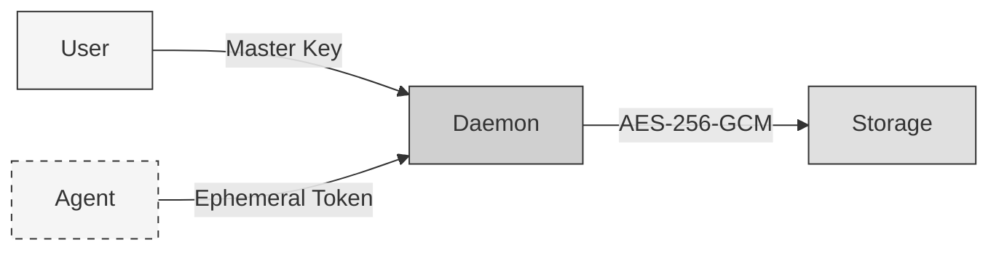
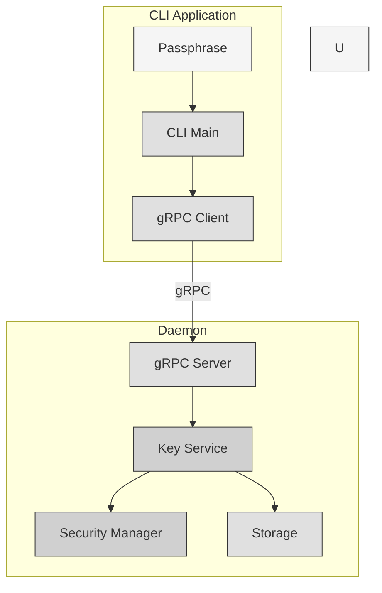
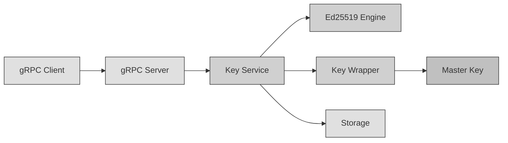
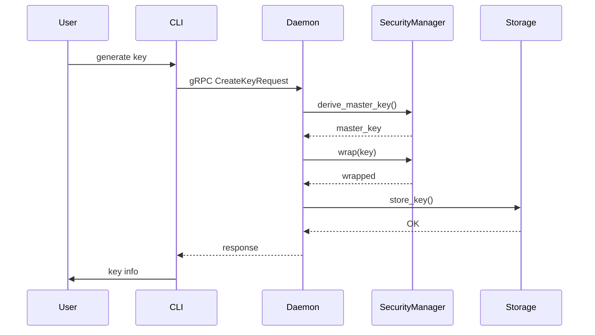
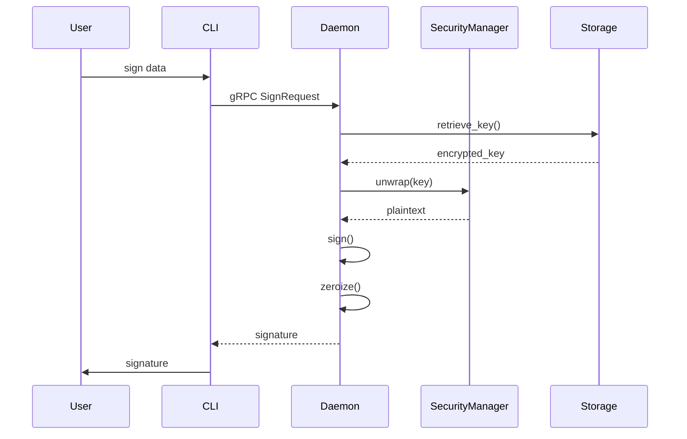
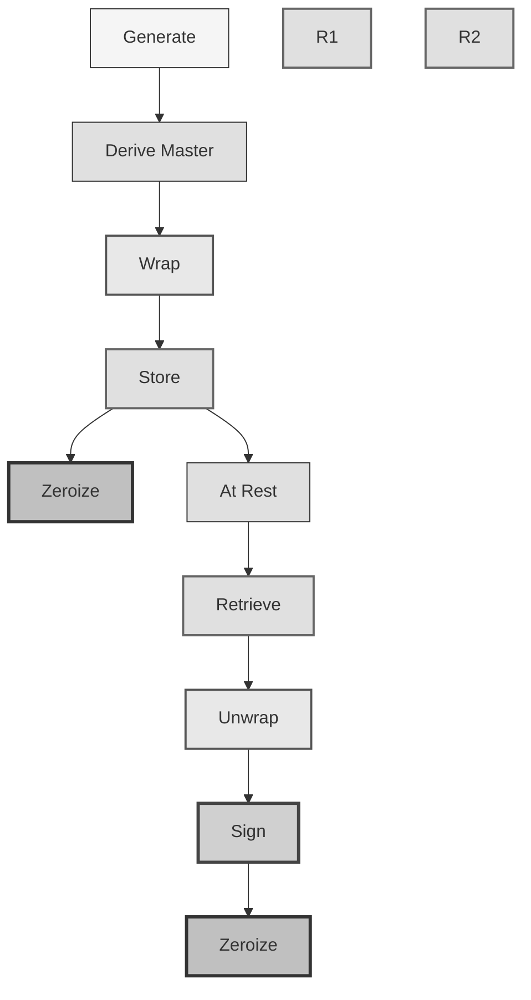
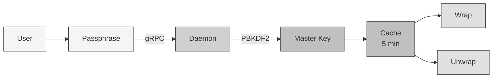

# CLI to Daemon Communication Architecture

## Security Principle: Isolation

The CLI **NEVER** accesses keys directly. All key operations go through the daemon.

## System Context Diagram



> **Future (dashed)**: Agent support - Same API, agents use ephemeral tokens with RBAC roles

## Container Diagram



## Component Diagram



## CLI Responsibilities

1. **Prompt user for passphrase** (securely via rpassword)
2. **Send gRPC requests** to daemon
3. **Display results** to user

## Daemon Responsibilities

1. **Receive passphrase via gRPC**
2. **Derive master key** (Security Layer - PBKDF2, 210k iter)
3. **Generate/derive keys**
4. **Wrap/Unwrap keys** (AES-256-GCM)
5. **Store to disk** (encrypted)
6. **Return key metadata** (NOT key material)

## Dynamic View: Create Key



## Dynamic View: Sign Data



## Key Security Lifecycle



## Passphrase Flow



## Security Benefits

1. **Isolation**: Keys never leave daemon process
2. **Single passphrase**: User enters once, cached securely
3. **Memory protection**: Automatic zeroization after use
4. **Encrypted at rest**: AES-256-GCM with unique salts
5. **Metadata binding**: AAD prevents tampering

## API Endpoints

```rust
// Keys
rpc CreateKey(CreateKeyRequest) returns (CreateKeyResponse);
rpc ListKeys(ListKeysRequest) returns (ListKeysResponse);
rpc GetKey(GetKeyRequest) returns (GetKeyResponse);
rpc DeleteKey(DeleteKeyRequest) returns (DeleteKeyResponse);
rpc Sign(SignRequest) returns (SignResponse);

// Seeds
rpc ImportSeed(ImportSeedRequest) returns (ImportSeedResponse);
rpc DeriveKey(DeriveKeyRequest) returns (DeriveKeyResponse);

// Health
rpc Health(HealthRequest) returns (HealthResponse);
```

## CLI Commands

```bash
# Initialize
softkms init

# Generate key
softkms generate --algorithm ed25519 --label "My Key"

# Sign data
softkms sign --key <uuid> --data "Hello"
# or by label:
softkms sign --label "My Key" --data "Hello"

# Import seed
softkms import-seed --mnemonic "abandon abandon ... about"

# List keys
softkms list

# Get key info
softkms info --key <uuid>

# Delete key
softkms delete --key <uuid> --force
```

## Security Considerations

### Passphrase Transmission
- Sent over gRPC (localhost in dev, TLS in production)
- Never logged
- Cleared from CLI memory after sending
- Used by daemon to derive master key

### Key Material
- **NEVER** returned to CLI
- Only metadata (ID, algorithm, label) returned
- Signing done by daemon, returns signature only

## Implementation Files

### Key Components
- `src/api/grpc.rs` - gRPC server implementation
- `src/key_service.rs` - Key lifecycle management
- `src/security/wrapper.rs` - AES-256-GCM wrap/unwrap
- `src/crypto/ed25519.rs` - Ed25519 signing
- `cli/src/main.rs` - CLI client

## Next Steps

1. ✅ REST/gRPC handlers implemented
2. ✅ HTTP/gRPC client in CLI
3. ✅ Passphrase prompting
4. ✅ End-to-end flow tested
5. ✅ Error handling
6. ✅ Logging
7. Add TLS support for production
8. Implement HD wallet derivation
9. Add audit logging
