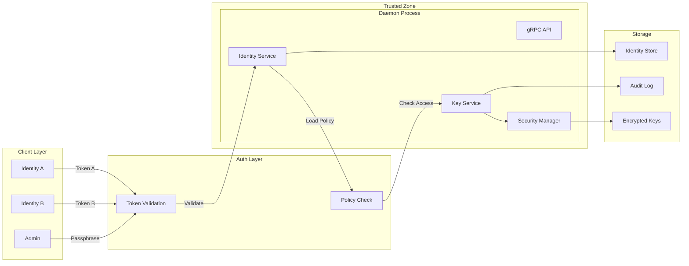
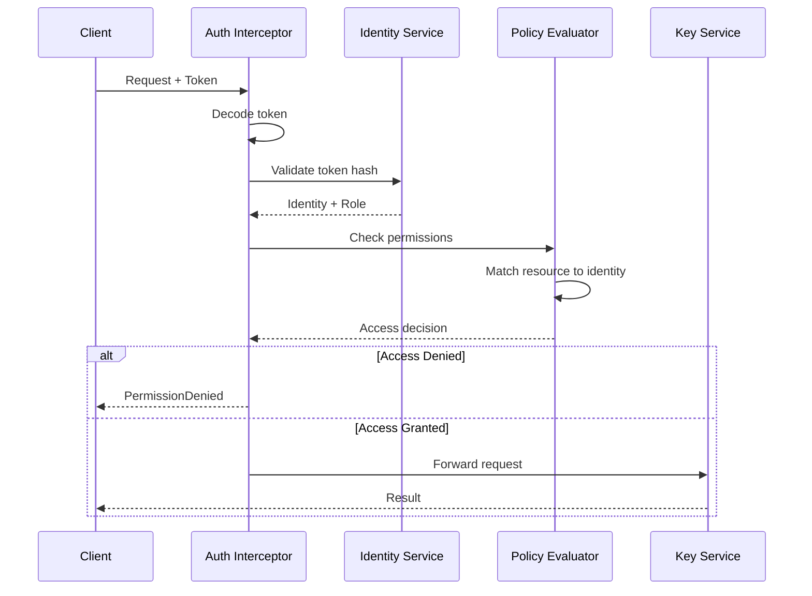

# softKMS Security Model

## Overview

softKMS implements a defense-in-depth security model with **identity-based access control**, where cryptographic keys are **NEVER stored or transmitted in plaintext**, and **each client has isolated access** to their own keys.

## Core Security Principles

### 1. Keys Never Exist in Plaintext at Rest

All keys are encrypted before storage using:
- **AES-256-GCM** with per-key unique nonces
- **Master key** derived via PBKDF2-HMAC-SHA256 (210,000 iterations)
- **Authenticated encryption** with AAD binding key to metadata

### 2. Identity Isolation

- **Each identity** (client) has isolated access to their own keys
- **Namespace separation**: Keys stored under identity's public key path
- **No cross-access**: Identity A cannot see or modify Identity B's keys
- **Admin oversight**: Admin can view all keys (for management)

### 3. Token-Based Authentication

- **Simple bearer tokens**: `base64(key_type:pubkey:secret)`
- **One-time display**: Token shown once at identity creation
- **Hash storage**: Server stores `SHA256(secret)`, not plaintext
- **No replay**: Each token bound to specific identity

### 4. Keys Only Unwrapped in Memory When Needed

```
Encrypted Storage → Memory (unwrapped) → Use → Zeroize → Back to encrypted
```

Keys are immediately cleared from memory after use using `zeroize`.

### 5. Client-Daemon Isolation

- **Daemon** holds all key material in isolated process
- **CLI Client** only sends requests, receives signatures
- **Keys NEVER leave the daemon** - only signatures and metadata
- **Communication** via gRPC over localhost only

### 6. Memory Protection

- Secrets use `secrecy::Secret<T>` wrapper
- Automatic zeroization on drop
- Cache with TTL expiration (5 minutes)
- No key material in swap (mlock where supported)

## Security Architecture



## Key Export Security

When exporting keys from softKMS to external formats (SSH, GPG), several security measures are in place:

### Key Material Handling

- **In-Memory Unwrapping**: Keys are decrypted (unwrapped) in memory only at the moment of export
- **Immediate Clearing**: Key material is zeroized immediately after export completes
- **No Persistent Decryption**: Exported keys are copies; the original remains encrypted in the keystore

### Authentication Requirements

- **Admin Access**: Export requires admin passphrase or identity token
- **Ownership Verification**: Clients can only export keys they own
- **Audit Logging**: All export operations are logged to the audit trail

### SSH Export Security

- **File Permissions**: Private keys are written with mode 0600 (owner read/write only)
- **Format**: Standard OpenSSH private key format
- **Supported Algorithms**: Ed25519 only (for SSH compatibility)

### GPG Export Security

- **Auto-Import**: Keys are automatically imported to GPG keyring via subprocess
- **Temporary File Handling**: 
  - Key written to temporary file (`{key_id}.asc`)
  - File deleted immediately after successful import
  - On import failure, file is deleted and error returned
- **Format**: ASCII-armored PGP private key block (RFC 4880)
- **Supported Algorithms**: Ed25519 and P-256
- **HD Key Support**: HD-derived keys (96 bytes) are handled - first 32 bytes (scalar) extracted

### Export vs. Key Recovery

| Aspect | Export | Key Recovery |
|--------|--------|--------------|
| Key leaves keystore | Yes (copy) | No |
| Original key encrypted | Yes, unchanged | Yes |
| Requires auth | Yes | Yes (admin) |
| Reversible | No | Yes (with backup) |

## Identity Security Model

### Authentication Flow



### Identity Types

| Identity | Auth | Access | Storage |
|----------|------|--------|---------|
| **Admin** | Passphrase | All keys | `~/.local/share/softkms/keys/admin/` |
| **Client** | Token | Own keys only | `~/.local/share/softkms/keys/{pubkey}/keys/` |

### Access Control Matrix

| Operation | Admin | Identity A | Identity B |
|-----------|-------|------------|------------|
| List keys | ✅ All | ✅ Own only | ✅ Own only |
| Create key | ✅ | ✅ Own only | ✅ Own only |
| Sign | ✅ All | ✅ Own only | ✅ Own only |
| Delete key | ✅ All | ✅ Own only | ❌ |
| Access A's keys | ✅ | ✅ | ❌ |
| Access B's keys | ✅ | ❌ | ✅ |
| Create identity | ✅ | ❌ | ❌ |
| View audit logs | ✅ | ❌ | ❌ |

## Token Security

### Token Format

```
token = base64(key_type:pubkey:secret)

Example:
Raw: ed25519:MCowBQY...:MTIzNDQ0NTU2Njc3
Base64: ZWQyNTUxOTpNQ293QlFZREsyVndBeUU...
```

### Security Properties

1. **Entropy**: 256-bit random secret
2. **Binding**: Token bound to specific public key
3. **One-way**: Server stores hash, cannot retrieve original
4. **Revocable**: Identity can be disabled without affecting other identities
5. **Isolated**: Each identity's token grants access only to their namespace

### Token Validation

```rust
// 1. Decode token
let parts = base64_decode(token)?.split(':');
let key_type = parts[0];
let pubkey = parts[1];
let secret = parts[2];

// 2. Hash secret
let provided_hash = sha256(secret);

// 3. Look up stored hash
let stored_hash = get_stored_hash(pubkey)?;

// 4. Compare
if provided_hash != stored_hash {
    return Err(InvalidToken);
}

// 5. Check if active
let identity = get_identity(pubkey)?;
if !identity.is_active {
    return Err(RevokedIdentity);
}
```

### Token Storage Security

**Client Side:**
- ✅ Environment variables (process-local)
- ✅ Secret managers (Kubernetes secrets, AWS Secrets Manager)
- ✅ Files with 0600 permissions
- ❌ Hardcoded in scripts
- ❌ Committed to version control
- ❌ Shared via chat/email

**Server Side:**
- Only stores `SHA256(secret)`
- No way to recover original token
- Identity metadata stored separately
- Token shown once at creation, never again

## Key Lifecycle

### Generation with Identity

```mermaid
sequenceDiagram
    participant ID as Identity
    participant KS as Key Service
    participant SEC as Security Manager
    participant ST as Storage
    
    ID->>KS: create_key(identity)
    KS->>SEC: get_master_key()
    SEC-->>KS: master_key
    
    KS->>Crypto: generate_key()
    Crypto-->>KS: (secret, public)
    
    KS->>SEC: wrap(secret, master_key)
    SEC-->>KS: wrapped_key
    
    KS->>ST: store_key(
        owner=identity.pubkey,
        wrapped_key
    )
    Note over ST: Path: {pubkey}/keys/{key_id}
```

### Access Control Check

```mermaid
sequenceDiagram
    participant CLI as Client
    participant AUTH as Auth
    participant ID as Identity Service
    participant KS as Key Service
    participant ST as Storage
    
    CLI->>AUTH: sign(token, key_id)
    AUTH->>ID: validate_token(token)
    ID-->>AUTH: identity
    
    AUTH->>KS: sign(identity, key_id)
    KS->>ST: get_key(key_id)
    ST-->>KS: key_metadata
    
    KS->>KS: check_owner(
        identity.pubkey == key_metadata.owner
    )
    
    alt Owner Match
        KS->>SEC: unwrap_key()
        SEC-->>KS: secret_key
        KS->>Crypto: sign(data, secret_key)
        Crypto-->>KS: signature
        KS-->>CLI: signature
    else Owner Mismatch
        KS-->>CLI: AccessDenied
    end
```

## Encryption Details

### Master Key Derivation

```rust
// Fixed salt stored in ~/.local/share/softkms/.salt (32 bytes)
master_key = PBKDF2-HMAC-SHA256(
    password: passphrase,
    salt: stored_salt,
    iterations: 210_000,
    output_length: 32 bytes
)
```

**Note:** Master key derived from admin passphrase, not identity tokens. Tokens provide access control, not key encryption.

### ⚠️ Single Master Key Architecture

**IMPORTANT:** All keys in the keystore are encrypted with a **single master key** derived from the admin passphrase. This design has important security implications:

| Aspect | Implementation | Impact |
|--------|---------------|--------|
| **Access Control** | Per-identity tokens | Identity A cannot access Identity B's keys via API |
| **Encryption** | Single master key | All keys encrypted with same key |
| **Isolation Level** | Logical (authorization) | Not cryptographic (encryption) |

**Security Implications:**

1. **Master Key Compromise**: If the master key is exposed, **ALL keys in the system are compromised** regardless of identity ownership
2. **No Cryptographic Isolation**: Physical access to encrypted storage + master key = access to all keys
3. **Admin Authority**: Anyone with the admin passphrase can decrypt any key (by design)

**When to Use This Model:**

✅ **Appropriate for:**
- Single-administrator deployments
- Internal services with trusted infrastructure
- Development and staging environments
- Small teams with shared security responsibility

❌ **Not recommended for:**
- Multi-tenant SaaS with untrusted tenants
- Environments requiring cryptographic compartmentalization
- Compliance regimes requiring per-user encryption boundaries
- High-risk scenarios with sophisticated threat actors

**Future Enhancement:** Per-identity encryption keys can be implemented by deriving separate KEKs (Key Encryption Keys) from identity-specific passphrases or credentials. This would provide cryptographic isolation at the cost of more complex key management.

### Key Wrapping

```rust
// Per-key encryption
nonce = random(12 bytes)
aad = metadata_json + owner_pubkey  // Binds key to owner

ciphertext = AES-256-GCM(
    key: master_key,
    nonce: nonce,
    plaintext: key_material,
    aad: aad
)

// Storage format
[version: 1 byte][nonce: 12 bytes][ciphertext + tag]
```

**AAD (Additional Authenticated Data)** prevents:
- Key substitution attacks
- Metadata tampering
- Cross-identity key movement

### Storage Format

```
~/.local/share/softkms/
├── keys/
│   ├── admin/                      # Admin keys
│   │   └── {key_id}.enc
│   ├── ed25519_AAA.../             # Identity A (isolated)
│   │   └── keys/
│   │       ├── {key_id}.json       # Metadata + owner
│   │       └── {key_id}.enc        # Encrypted key
│   └── ed25519_BBB.../             # Identity B (isolated)
│       └── keys/
│           ├── {key_id}.json
│           └── {key_id}.enc
├── identities/
│   ├── ed25519_AAA...json          # Identity record
│   └── index.json                   # Quick lookup
~/.local/state/softkms/
├── audit.log                        # JSON Lines
~/.local/share/softkms/
├── .salt                            # PBKDF2 salt
└── .verification_hash               # Passphrase verification
```

**Note:** Paths differ between user mode (XDG Base Directory: `~/.local/share/softkms/` and `~/.local/state/softkms/`) and system mode (FHS: `/var/lib/softkms/` and `/var/log/softkms/`).

**Key Metadata:**
```json
{
  "id": "key_abc123",
  "algorithm": "ed25519",
  "label": "mykey",
  "owner": "ed25519:MCowBQY...",
  "created_at": "2026-02-16T14:30:00Z"
}
```

## Audit Logging

### Audit Log Structure

**Format**: JSON Lines (append-only)

**Location**: `~/.local/state/softkms/audit.log`

**Entry Schema:**
```json
{
  "sequence": 12345,
  "timestamp": "2026-02-16T14:30:00Z",
  "identity_pubkey": "ed25519:MCowBQY...",
  "identity_type": "client",
  "action": "Sign",
  "resource": "ed25519:MCowBQY.../keys/key_001",
  "allowed": true,
  "reason": null,
  "source_ip": "127.0.0.1"
}
```

### Logged Events

| Event | Identity Logged | Resource | Result |
|-------|----------------|----------|--------|
| Identity created | Admin | New identity | ✅ |
| Identity revoked | Admin | Revoked identity | ✅ |
| Key created | Creator | New key | ✅ |
| Key deleted | Requester | Deleted key | ✅/❌ |
| Sign | Requester | Key used | ✅/❌ |
| Access denied | Requester | Attempted resource | ❌ |
| Auth failure | Attempted | - | ❌ |

### Log Security

- **Append-only**: Cannot modify history
- **Rotation**: Daily, 30-day retention
- **Integrity**: Future - hash chain
- **Export**: Can forward to SIEM

## Threat Model

### Protected Against

| Threat | Mitigation |
|--------|-----------|
| **Storage theft** | AES-256-GCM encryption |
| **Passphrase brute-force** | PBKDF2 with 210k iterations |
| **Memory dumps** | `zeroize` + `secrecy` crate |
| **Key substitution** | AAD binds key to owner |
| **Network sniffing** | gRPC over localhost only |
| **Weak passphrases** | Verification hash |
| **Cross-identity access** | Namespace isolation |
| **Token replay** | Bound to specific identity |
| **Token interception** | TLS (future) + localhost only |
| **Identity spoofing** | Cryptographic token validation |

### Identity-Specific Threats

| Threat | Risk | Mitigation |
|--------|------|-----------|
| **Token leak** | High | Revoke immediately, create new identity |
| **Token sharing** | Medium | One identity per service, monitor audit logs |
| **Privilege escalation** | Low | Admin operations require passphrase |
| **Key enumeration** | Low | Can only list own keys |
| **DoS via identity creation** | Low | Admin controls identity creation |

### Accepted Risks

| Risk | Rationale | Mitigation |
|------|-----------|------------|
| **Daemon compromise** | Process isolation | Run as dedicated user, systemd hardening |
| **Physical memory access** | OS protection | mlock, encrypted swap |
| **Side-channel attacks** | Constant-time crypto | Rust + ring crate |
| **Social engineering** | Out of scope | User education, token security guidelines |
| **Backup exposure** | User responsibility | Encrypted backups, separate passphrase storage |

## Security Best Practices

### For Administrators

1. **Strong passphrase**: 16+ chars, mixed case, symbols
2. **Dedicated user**: Run daemon as non-root
3. **File permissions**: `700` on data directory
4. **Regular backups**: Encrypted, offline
5. **Monitor audit logs**: Watch for anomalies
6. **Revoke unused identities**: Minimize attack surface
7. **Token rotation**: Periodic identity recreation

### For Service Operators

1. **One identity per service**: No sharing
2. **Secure token storage**: Secret managers only
3. **Environment isolation**: Dev/staging/prod identities
4. **Key cleanup**: Delete temporary keys
5. **Access monitoring**: Log analysis
6. **Least privilege**: Minimal required operations

### For Token Security

```bash
# ✅ Good: Kubernetes secret
kubectl create secret generic softkms-token \
  --from-literal=token="..."

# ✅ Good: Docker secret
echo "..." | docker secret create softkms_token -

# ✅ Good: Environment file (secure)
chmod 600 /etc/softkms/token.env
source /etc/softkms/token.env

# ❌ Bad: Hardcoded
curl ... --token "ZGlkOmtleTp6..."

# ❌ Bad: Process listing visible
export SOFTKMS_TOKEN="..."  # In shared environment

# ❌ Bad: Version control
echo $SOFTKMS_TOKEN > config.txt  # Oops!
```

## Security Guarantees

### Confidentiality
- ✅ Keys encrypted at rest (AES-256-GCM)
- ✅ Master key derived with 210k PBKDF2
- ✅ Keys only unwrapped during operations
- ✅ Identity isolation (no cross-access)
- ✅ Token secrets hashed (SHA256)

### Integrity
- ✅ AAD prevents key/metadata tampering
- ✅ GCM authentication tags
- ✅ Owner verification on all operations
- ✅ Audit log of all access attempts
- ✅ Passphrase verification hash

### Availability
- ✅ Isolated failure domains per identity
- ✅ No single point of failure
- ✅ Graceful degradation
- ✅ Audit logs for forensics

### Access Control
- ✅ Role-based (admin/client)
- ✅ Identity isolation (namespace)
- ✅ Resource-level permissions
- ✅ Audit trail for all operations

## Compliance

### Cryptographic Standards

- **AES-256-GCM** - NIST SP 800-38D
- **PBKDF2** - NIST SP 800-132
- **Ed25519** - RFC 8032
- **P-256** - NIST SP 800-186
- **SHA-256** - FIPS 180-4
- **Falcon-512/1024** - NIST PQC Standard (FIPS 204)

### Audit Requirements

- ✅ All operations logged
- ✅ Identity context recorded
- ✅ Success/failure tracked
- ✅ Resource access documented
- ✅ Immutable audit trail

### Data Residency

- Keys encrypted at rest
- Identity metadata local
- Audit logs configurable export
- No external dependencies

## Security Testing

### Automated Tests

| Test | Purpose | Location |
|------|---------|----------|
| `test_token_validation` | Valid/invalid tokens | `identity/mod.rs` |
| `test_identity_isolation` | Cross-identity access denied | `identity/policy.rs` |
| `test_revoked_identity` | Revoked token rejected | `identity/storage.rs` |
| `test_wrong_passphrase` | Admin auth failure | `security/wrapper.rs` |
| `test_access_denied_logged` | Audit log on denial | `audit/mod.rs` |
| `test_owner_verification` | Key ownership check | `key_service.rs` |

### Manual Security Verification

```bash
# 1. Verify identity isolation
# Create two identities
TOKEN_A=$(softkms identity create --type test | grep Token | cut -d' ' -f2)
TOKEN_B=$(softkms identity create --type test | grep Token | cut -d' ' -f2)

# A creates key
softkms --token "$TOKEN_A" generate --label key-a

# B tries to access A's key
softkms --token "$TOKEN_B" sign --label key-a --data "test"
# Should fail: Access denied

# 2. Verify token not stored
strings ~/.local/share/softkms/identities/*.json | grep "token"
# Should NOT show full token

# 3. Verify audit log
cat ~/.local/state/softkms/audit.log | jq '.[] | select(.allowed==false)'
# Should show denied attempts

# 4. Verify encrypted storage
file ~/.local/share/softkms/keys/*/*/*.enc
# Should show: data (encrypted)
```

### Penetration Testing Checklist

Identity Security:
- [ ] Create identity, save token, verify works
- [ ] Try accessing another identity's keys (should fail)
- [ ] Revoke identity, verify token rejected
- [ ] Try guessing token (should fail)
- [ ] Verify token not in process memory after use
- [ ] Check audit log shows all operations
- [ ] Verify admin can see all keys
- [ ] Test token replay (should work, bound to identity)

Key Security:
- [ ] Verify encrypted files contain no plaintext
- [ ] Test wrong passphrase rejection
- [ ] Verify keys not in process memory after use
- [ ] Check gRPC only binds to localhost
- [ ] Verify cache expiration

## Security Vulnerabilities

### Reporting

Report security issues privately:
1. Email: security@softkms.example
2. Do not open public issues
3. Include reproduction steps
4. Allow 90 days for fix

### Known Limitations

1. **Fixed salt** - Trade-off for passphrase verification
2. **Memory protection** - Best effort via Rust, not hardware
3. **No token expiration** - Manual revocation only (for now)
4. **No HSM support** - Planned for TPM2
5. **No real-time audit streaming** - File-based only

## References

- [Architecture](ARCHITECTURE.md) - System design with identity layer
- [Identity Management](IDENTITIES.md) - Identity system details
- [Usage Guide](USAGE.md) - Practical security practices
- [API Reference](API.md) - Security-related API calls

---

**Last Updated**: 2026-02-16
**Version**: 0.3
