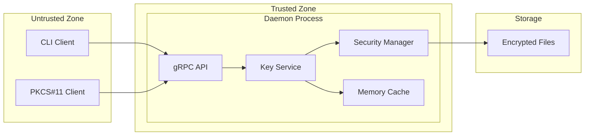
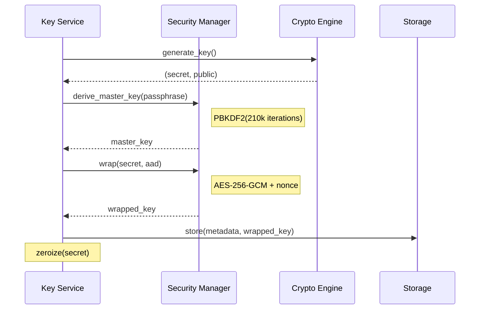
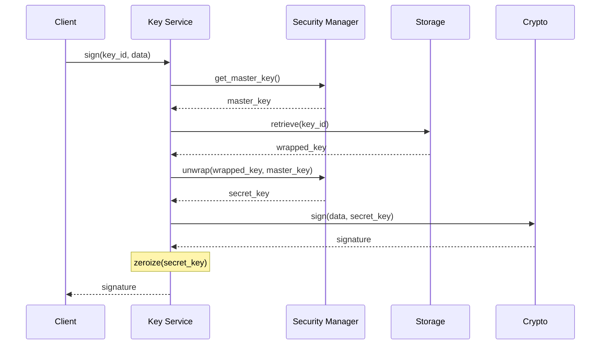

# softKMS Security Model

## Overview

softKMS implements a defense-in-depth security model where cryptographic keys are **NEVER stored or transmitted in plaintext**. This document describes the security architecture, threat model, and guarantees.

## Core Security Principles

### 1. Keys Never Exist in Plaintext at Rest

All keys are encrypted before storage using:
- **AES-256-GCM** with per-key unique nonces
- **Master key** derived via PBKDF2-HMAC-SHA256 (210,000 iterations)
- **Authenticated encryption** with AAD binding key to metadata

### 2. Keys Only Unwrapped in Memory When Needed

```
Encrypted Storage → Memory (unwrapped) → Use → Zeroize → Back to encrypted
```

Keys are immediately cleared from memory after use using `zeroize`.

### 3. Client-Daemon Isolation

- **Daemon** holds all key material in isolated process
- **CLI Client** only sends requests, receives signatures
- **Keys NEVER leave the daemon** - only signatures and metadata
- Communication via gRPC over localhost only

### 4. Memory Protection

- Secrets use `secrecy::Secret<T>` wrapper
- Automatic zeroization on drop
- Cache with TTL expiration (5 minutes)
- No key material in swap (mlock where supported)

## Security Architecture



## Key Lifecycle

### Generation



### Signing



## Encryption Details

### Master Key Derivation

```rust
// Fixed salt stored in ~/.softKMS/.salt (32 bytes)
master_key = PBKDF2-HMAC-SHA256(
    password: passphrase,
    salt: stored_salt,
    iterations: 210_000,
    output_length: 32 bytes
)
```

**Why fixed salt?**
- Enables passphrase verification across daemon restarts
- Salt is stored alongside verification hash
- Still provides brute-force resistance via high iteration count

### Key Wrapping

```rust
// Per-key encryption
nonce = random(12 bytes)
aad = metadata_json  // Binds key to its metadata

ciphertext = AES-256-GCM(
    key: master_key,
    nonce: nonce,
    plaintext: key_material,
    aad: aad
)

// Storage format
[version: 1 byte][nonce: 12 bytes][ciphertext + tag]
```

**AAD (Additional Authenticated Data)** prevents:
- Key substitution attacks
- Metadata tampering
- Cross-key attacks

### Storage Format

```
~/.softKMS/
├── keys/
│   ├── <key-id>.json       # Metadata (unencrypted)
│   │   {
│   │     "id": "uuid",
│   │     "algorithm": "ed25519",
│   │     "label": "mykey",
│   │     "created_at": "2026-01-...",
│   │     "public_key": "base64..."
│   │   }
│   └── <key-id>.enc        # Encrypted key material
│       [version][nonce][ciphertext][tag]
├── .salt                     # PBKDF2 salt (32 bytes)
└── .verification_hash        # Passphrase verification
```

## Threat Model

### Protected Against

| Threat | Mitigation |
|--------|-----------|
| **Storage theft** | AES-256-GCM encryption |
| **Passphrase brute-force** | PBKDF2 with 210k iterations |
| **Memory dumps** | `zeroize` + `secrecy` crate |
| **Key substitution** | AAD binds key to metadata |
| **Network sniffing** | gRPC over localhost only |
| **Weak passphrases** | Verification hash prevents guess-check |

### Accepted Risks

| Risk | Rationale |
|------|-----------|
| **Daemon compromise** | Process isolation, run as dedicated user |
| **Physical memory access** | Protected by OS memory isolation |
| **Side-channel attacks** | Rust + constant-time crypto primitives |
| **Social engineering** | Out of scope - user education needed |

### Out of Scope

- **Malware on client machine** - User's responsibility
- **Hardware attacks** - TPM2 support planned
- **Denial of service** - Not a security concern
- **Backup security** - User manages backups

## Security Guarantees

### Confidentiality
- Keys are encrypted at rest with AES-256-GCM
- Master key derived with 210k PBKDF2 iterations
- Keys only in memory during operations

### Integrity
- AAD prevents key/metadata tampering
- GCM authentication tags
- Verification hash prevents passphrase guessing

### Availability
- No single point of failure (file storage)
- No network dependencies
- Graceful degradation on errors

## Security Best Practices

### Passphrases

**Requirements:**
- Minimum 12 characters
- Mix of uppercase, lowercase, numbers, symbols
- Not dictionary words
- Unique per keystore

**Example strong passphrase:**
```
Tr0ub4dor&3!2026-KMS
```

### Daemon Security

```bash
# Run as dedicated user
useradd -r softkms
chown -R softkms:softkms /var/lib/softkms

# Restrict permissions
chmod 700 /var/lib/softkms
chmod 600 /var/lib/softkms/.salt

# Systemd hardening
# See systemd service file for example
```

### Backup Security

```bash
# Backup encrypted keys
tar czf softkms-backup.tar.gz ~/.softKMS/keys/

# Store passphrase separately
# Use password manager or hardware token
```

## Security Testing

### Automated Tests

The codebase includes security-focused tests:

| Test | Purpose | Location |
|------|---------|----------|
| `test_wrong_passphrase` | Verify incorrect passphrase fails | `security/wrapper.rs` |
| `test_passphrase_consistency` | Same passphrase works across operations | `integration_tests.rs` |
| `test_wrapped_key_tampering` | Detect modified ciphertext | `security/wrapper.rs` |
| `test_cache_expiration` | Verify master key cache TTL | `security/mod.rs` |
| `test_encrypted_storage` | Verify keys encrypted at rest | `e2e/smoke_tests.rs` |

### Manual Security Verification

```bash
# 1. Verify encrypted storage
ls -la ~/.softKMS/keys/
# Should see .enc files

# 2. Check no plaintext keys
strings ~/.softKMS/keys/*.enc | head
# Should be garbage/random

# 3. Verify passphrase required
softkms list
# Should prompt for passphrase (if not cached)

# 4. Check daemon doesn't expose keys
curl http://localhost:8080/keys
# Should fail or not expose key material
```

### Penetration Testing Checklist

- [ ] Verify encrypted files contain no plaintext
- [ ] Test wrong passphrase rejection
- [ ] Verify keys not in process memory after use
- [ ] Check gRPC only binds to localhost
- [ ] Verify cache expiration
- [ ] Test key deletion removes files
- [ ] Verify AAD prevents substitution

## Compliance

### Cryptographic Standards

- **AES-256-GCM** - NIST SP 800-38D
- **PBKDF2** - NIST SP 800-132
- **Ed25519** - RFC 8032
- **P-256** - NIST SP 800-186

### Audit Logging (Future)

```rust
// Planned: All security-relevant events logged
key_created(user, key_id)
key_accessed(user, key_id, operation)
sign_attempt(user, key_id, success)
passphrase_changed(user)
```

## Security Vulnerabilities

### Reporting

Report security issues privately:
1. Email: security@softkms.example
2. Do not open public issues
3. Include reproduction steps
4. Allow 90 days for fix

### Known Limitations

1. **Fixed salt** - Trade-off for passphrase verification
2. **Memory protection** - Best effort via Rust, not hardware
3. **No audit log** - Not yet implemented
4. **No HSM support** - Planned for TPM2

## References

- [Architecture](ARCHITECTURE.md) - System design
- [Usage Guide](USAGE.md) - Practical security practices
- [API Reference](API.md) - Security-related API calls

---

**Last Updated**: 2026-02-16
**Version**: 0.2
