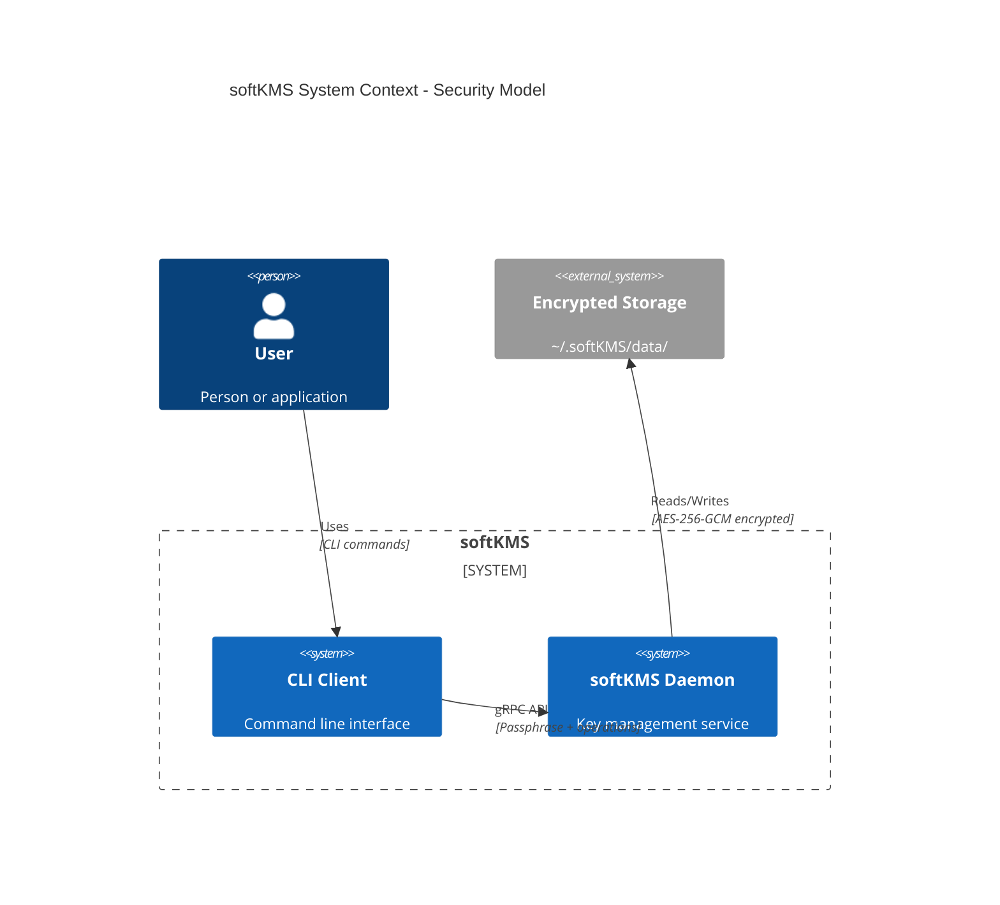
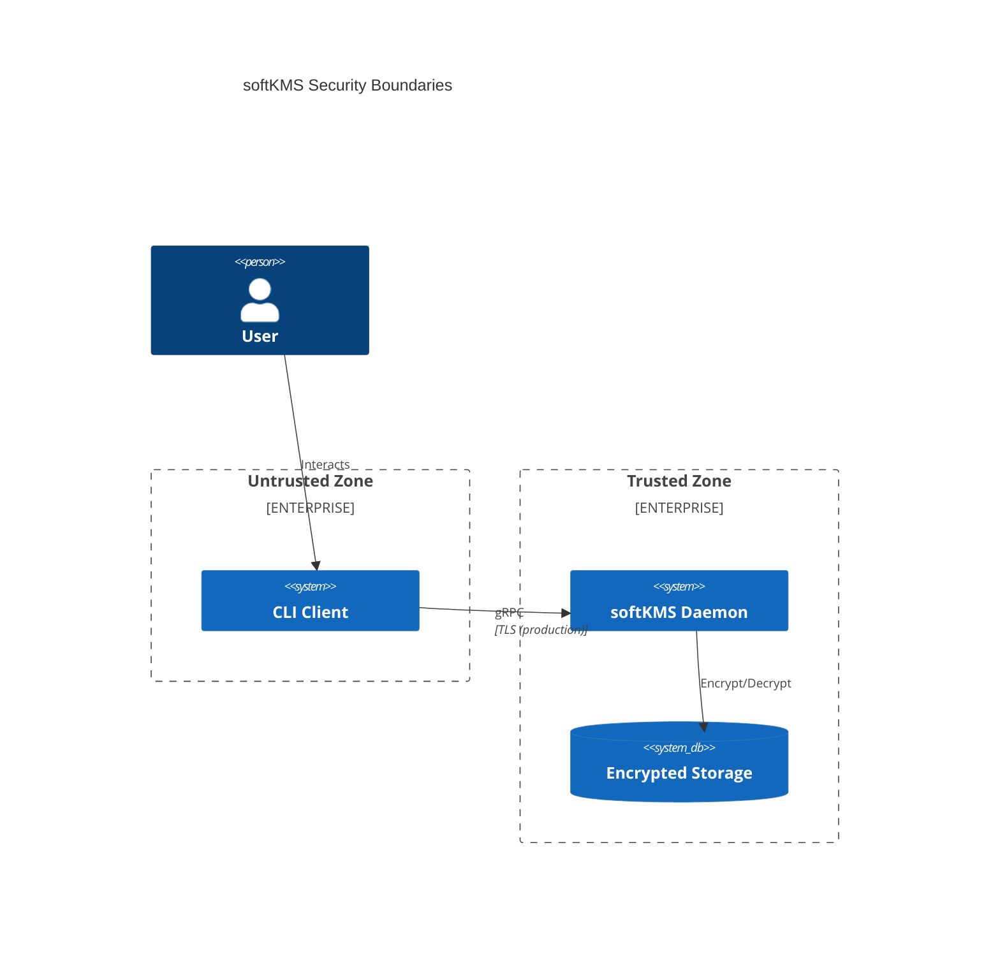
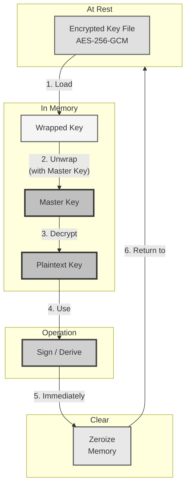
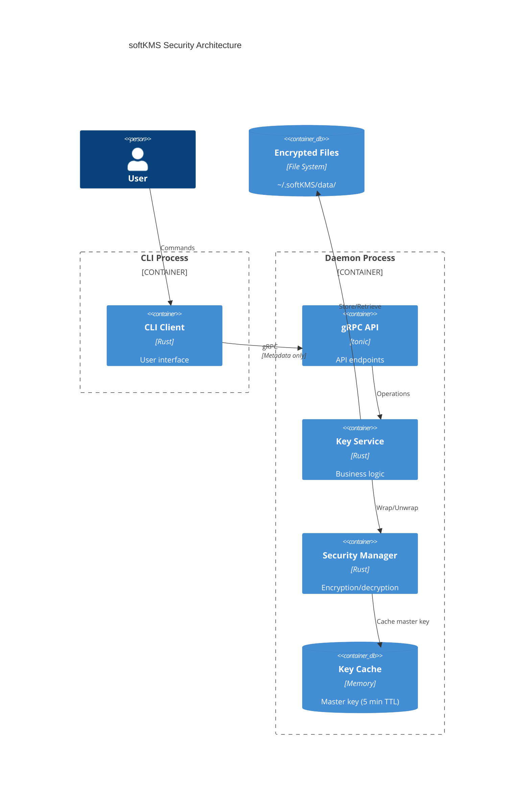
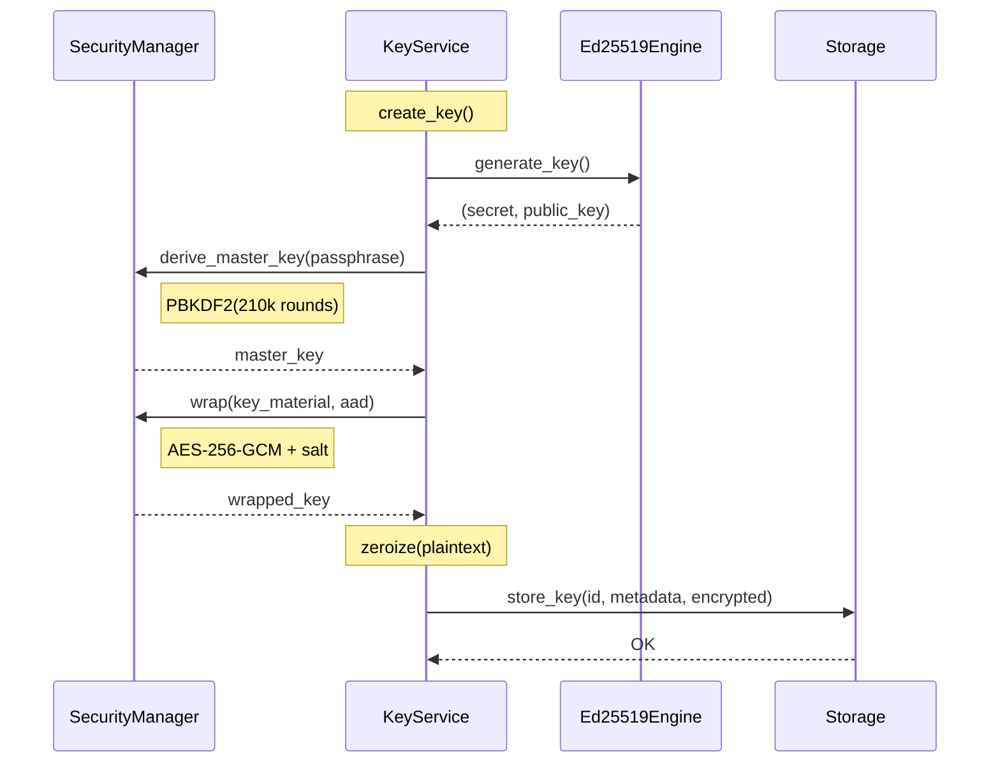
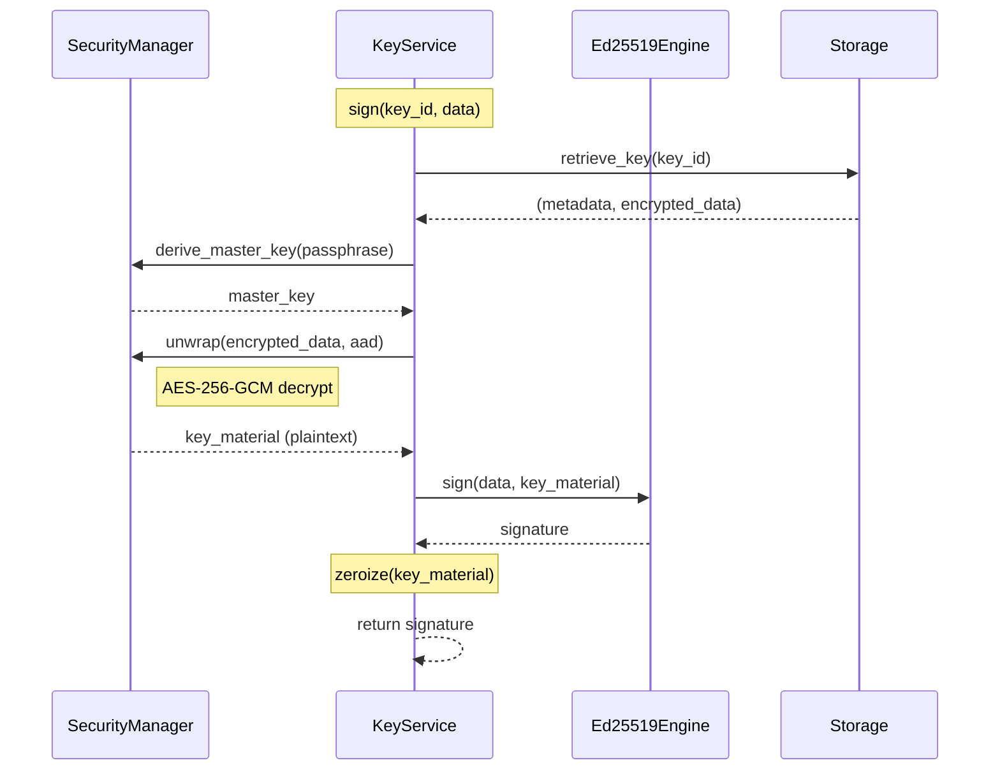
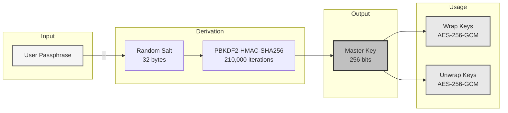
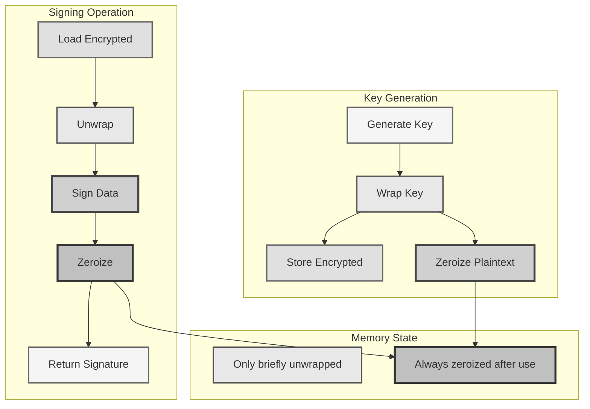
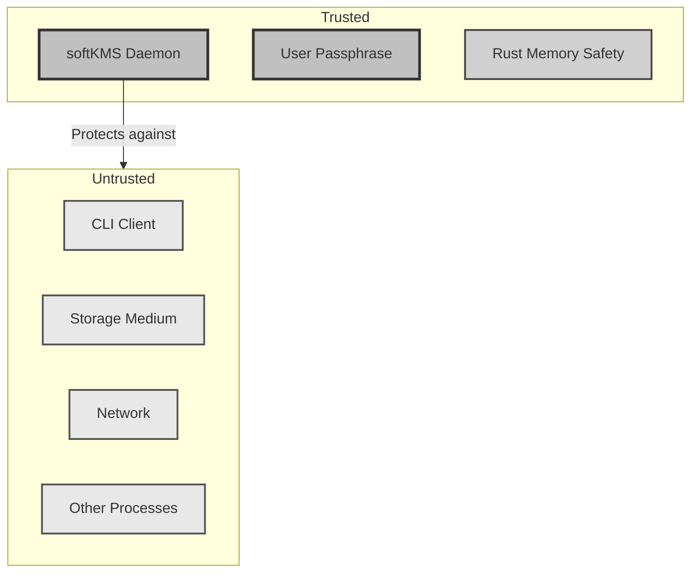
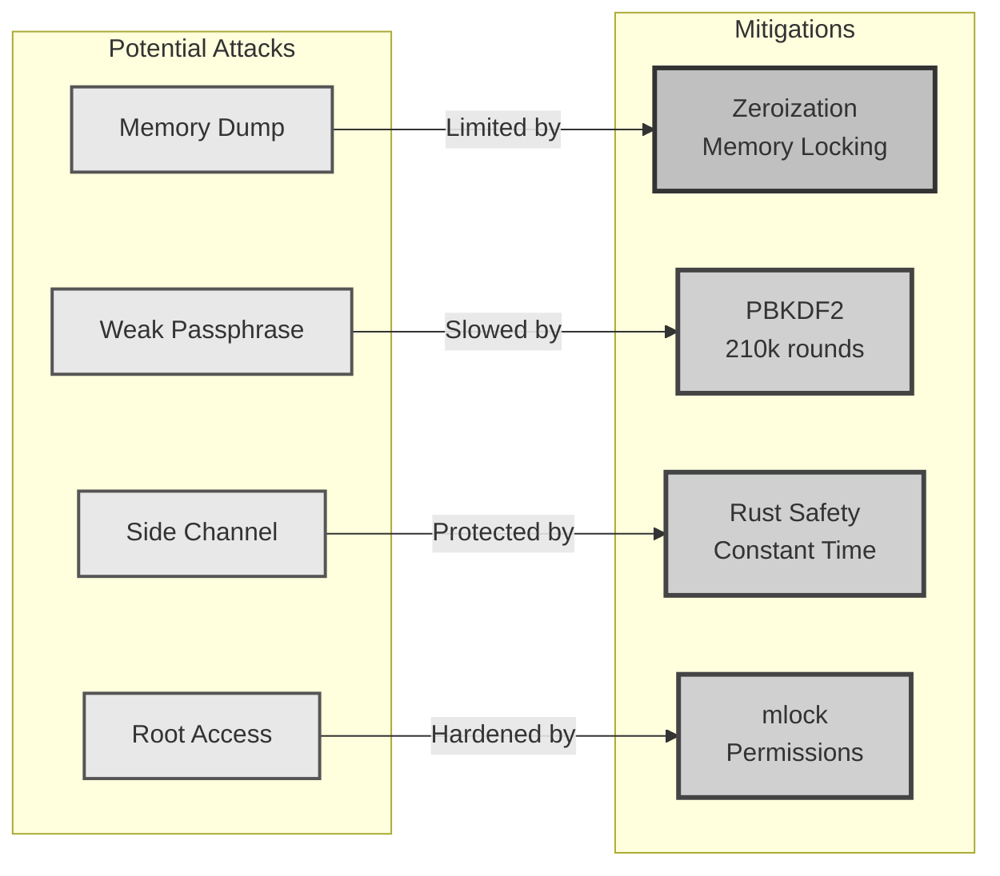

# softKMS Security Model

## Overview

softKMS implements a secure key management system where cryptographic keys are **NEVER stored in plaintext**. This document describes the security model, key lifecycle, and guarantees provided by the system.

## System Context



## Security Boundaries



## Core Security Principles

### 1. Keys Never Exist in Plaintext at Rest

All keys (including seeds, derived keys, and imported keys) are encrypted before being written to storage. The encryption uses:

- **AES-256-GCM** with per-key unique salts (32 bytes)
- **Master key** derived from user passphrase via PBKDF2-HMAC-SHA256 (210,000 iterations)
- **Authenticated encryption** - metadata bound to key material via AAD

### 2. Keys Only Unwrapped in Memory When Needed



**Timeline:**
1. Key exists encrypted on disk (AES-256-GCM)
2. When needed: decrypted in memory
3. Operation performed (sign, verify, etc.)
4. **Immediately cleared** from memory using `zeroize`
5. Key returns to encrypted state

### 3. Client-Daemon Isolation



- **Daemon** holds all key material - runs as isolated process
- **Client (CLI)** only sends requests and receives metadata/signatures
- **Keys NEVER leave the daemon** - only signatures and public metadata
- Communication via gRPC over localhost

## Key Lifecycle

### Generation Flow



```rust
// 1. Generate key in memory
let (secret_key, public_key) = Ed25519Engine::generate_key()?;

// 2. Get master key (prompts for passphrase if not cached)
let master_key = security_manager.get_master_key()?;

// 3. Wrap key material
let wrapper = security_manager.create_wrapper(&master_key);
let aad = build_aad(&metadata);  // Bind to metadata
let wrapped = wrapper.wrap(&key_material, &aad)?;

// 4. Clear plaintext
secret_key.zeroize();
drop(master_key);

// 5. Store encrypted
storage.store_key(id, &metadata, &wrapped.to_bytes()).await?;
```

### Signing Flow



```rust
// 1. Retrieve encrypted key from storage
let (metadata, encrypted_data) = storage.retrieve_key(key_id).await?;

// 2. Get master key
let master_key = security_manager.get_master_key()?;

// 3. Unwrap
let wrapper = security_manager.create_wrapper(&master_key);
let wrapped = WrappedKey::from_bytes(&encrypted_data)?;
let key_material = wrapper.unwrap(&wrapped, &aad)?;

// 4. Sign
let signature = Ed25519Engine::sign(&key_material, data)?;

// 5. IMMEDIATELY clear from memory
key_material.zeroize();
drop(master_key);

// Return only signature
Ok(signature)
```

## Encryption Details

### Wrapped Key Format

Binary format: `[version:1][salt:32][nonce:12][tag:16][aad_hash:32][ciphertext:N]`

- **version**: Format version (currently 1)
- **salt**: Unique per-key salt for additional entropy
- **nonce**: AES-GCM nonce (12 bytes, randomly generated)
- **tag**: Authentication tag (16 bytes)
- **aad_hash**: SHA-256 hash of authenticated additional data
- **ciphertext**: The encrypted key material

### Master Key Derivation



### Additional Authenticated Data (AAD)

The AAD binds the encrypted key to its metadata:

```rust
format!("softkms:key:{}:{}:{:?}:{}",
    metadata.id, metadata.algorithm, metadata.key_type, metadata.created_at
)
```

This prevents:
- **Tampering**: Changing metadata invalidates the authentication tag
- **Replay attacks**: Each key is uniquely bound to its creation context
- **Algorithm confusion**: Key type is cryptographically bound

## Memory Protection

### Automatic Zeroization

Sensitive data uses `secrecy::Secret<T>` and `zeroize::ZeroizeOnDrop`:

```rust
use secrecy::Secret;
use zeroize::{Zeroize, ZeroizeOnDrop};

pub struct Ed25519Key {
    #[zeroize(skip)]  // Don't zeroize non-sensitive data
    pub id: KeyId,
    pub secret_key: Secret<[u8; 32]>,  // Auto-zeroized on drop
    #[zeroize(skip)]
    pub metadata: KeyMetadata,
}
```

### Memory Flow



### Memory Locking (Optional)

On Unix systems, the master key can be locked in RAM:

```rust
#[cfg(unix)]
pub fn try_mlock(&self) -> Result<()> {
    use libc::{c_void, mlock};
    let ptr = self.key.expose_secret().as_ptr() as *const c_void;
    unsafe { mlock(ptr, 32) }
}
```

This prevents sensitive key material from being swapped to disk.

## Threat Model

### Trusted Components



- The softKMS daemon process
- The user's passphrase (secret)
- The operating system's memory management (with caveats)

### Untrusted Components

- Client applications (CLI, other software)
- Network (even localhost is treated as untrusted)
- Storage medium (disk can be inspected by attackers)
- Other processes on the system

### Security Guarantees

1. **Confidentiality**: Keys encrypted at rest with AES-256-GCM
2. **Integrity**: Metadata bound to keys via AAD
3. **Availability**: Master key cached for 5 minutes (configurable) to avoid repeated passphrase prompts
4. **Forward secrecy**: Each key has unique salt, compromise of one key doesn't expose others
5. **Memory safety**: Rust memory safety + automatic zeroization

### Limitations



1. **Memory dumps**: If an attacker can read daemon memory while keys are unwrapped, keys are exposed
2. **Passphrase attacks**: Weak passphrases can be brute-forced offline if storage is accessed
3. **Side channels**: Timing/power analysis not currently mitigated
4. **Root access**: If attacker has root, they can read memory (mlock helps but isn't absolute)

## Passphrase Best Practices

The security of the entire system rests on the passphrase:

- **Minimum 12 characters** recommended
- **Mix of uppercase, lowercase, numbers, symbols**
- **No dictionary words or personal information**
- **Use a password manager if possible**

The PBKDF2 iterations (210,000) provide resistance to brute-force attacks but cannot compensate for weak passphrases.

## Audit Logging

Future versions will include:
- Key generation events
- Signing operations (without exposing key material)
- Passphrase changes
- Failed authentication attempts

## Comparison to SoftHSM

| Feature | SoftHSM | softKMS |
|---------|---------|---------|
| Encryption at rest | ✓ | ✓ (AES-256-GCM) |
| Keys in memory | Always | Only when needed |
| Memory zeroization | No | Yes (zeroize) |
| Master key derivation | Fixed | PBKDF2 (210k rounds) |
| Client-daemon model | No | Yes (gRPC) |
| HD wallet support | No | Yes |

## Summary

softKMS provides strong security guarantees:

✓ **Keys never exist plaintext at rest**  
✓ **Keys only in memory when actively being used**  
✓ **Automatic memory clearing after operations**  
✓ **Client cannot access raw key material**  
✓ **Metadata cryptographically bound to keys**  
✓ **Modern Rust memory safety**

The security model ensures that even if an attacker:
- Gains access to the storage files → Only sees encrypted data
- Intercepts gRPC communication → Only sees metadata/signatures
- Has access to client application → Cannot extract private keys

The only way to access keys is to:
1. Compromise the running daemon
2. Extract the master key from memory (only valid for 5 minutes)
3. Have the user's passphrase

This defense-in-depth approach provides enterprise-grade key security in a software-based solution.
