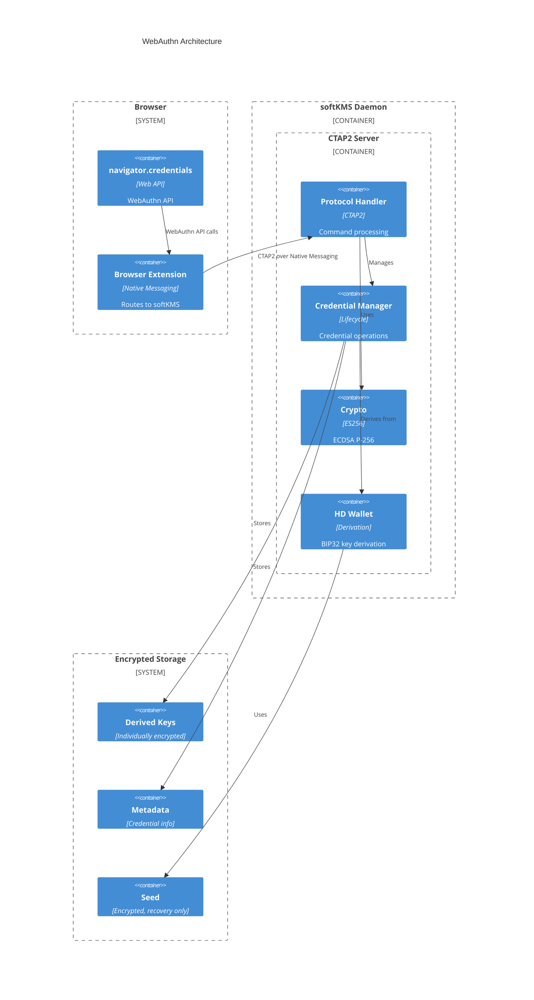

# WebAuthn/FIDO2 Authenticator Support

**Status**: Optional module (not enabled by default)

softKMS can optionally act as a software-based FIDO2 authenticator for WebAuthn/Passkey operations. This enables:
- Backup and recovery of hardware security keys
- Cross-device credential synchronization via HD wallet seeds
- Passkey management with seed-based recovery
- Development and testing of WebAuthn applications

## Overview

### Use Cases

1. **Hardware Key Backup**: Clone your YubiKey to softKMS for backup
2. **Passkey Recovery**: Recover all passkeys from a single seed phrase
3. **Cross-Device Sync**: Same seed → same credentials on all devices
4. **Development**: Test WebAuthn without hardware

### Security Model

**Important**: This is a *software* authenticator, not hardware. Consider:
- **Benefits**: Seed backup, cross-device sync, no vendor lock-in
- **Risks**: Software is more vulnerable than hardware keys
- **Recommendation**: Use for backup/recovery, not primary authentication

## Architecture



## Design Decisions

### 1. Integration Method: Native Messaging ✓

**Chosen**: Browser extension + Native Messaging

**Why**:
- Simpler than USB HID emulation
- Cross-browser support (Chrome, Firefox, Edge)
- No kernel modules required
- Easier to debug and develop

**Future**: System-level integration can be added later for seamless experience.

### 2. HD Wallet Security Model ✓

**Decided**:
- **Seed**: NEVER kept decrypted in memory after initial import
- **Derived keys**: Each encrypted individually at rest
- **Usage**: Decrypt specific key on-demand, clear after use
- **Recovery**: Re-derive from seed when needed (rare)

**Implementation**:
```rust
// Seed stored encrypted, decrypted only during import
pub struct Seed {
    encrypted_material: Vec<u8>,  // AES-GCM encrypted
    // Cleared from memory after derivation
}

// Each derived key encrypted separately
pub struct DerivedKey {
    derivation_path: String,     // e.g., "m/2017'/0'/0'/0/123"
    encrypted_key: Vec<u8>,       // Encrypted private key
    // Loaded and decrypted only when needed
}
```

**Benefits**:
- Compromised derived key doesn't expose seed
- Seed only in memory briefly during recovery
- Keys compartmentalized by derivation path
- Memory attacks limited to active keys only

### 3. Attestation Strategy: Self-Attestation ✓

**Chosen**: Self-attestation (no external attestation)

**Why**:
- Most relying parties (RPs) accept it
- Simpler implementation
- No dependency on external certificates
- Privacy-preserving (no tracking)

**What this means**:
- softKMS generates its own attestation key pair
- Credentials signed with this key
- RPs see "self-attested" in attestation
- Works with GitHub, Google, Microsoft, etc.

**Future**: Could support importing attestation certificates if needed.

### 4. Resident Key Support: Both Types ✓

**Decided**: Support both resident and non-resident credentials

**Non-Resident (Traditional)**:
- Credential ID returned to RP
- RP stores and provides it during authentication
- Like traditional U2F/WebAuthn keys
- Lower storage requirements

**Resident/Discoverable (Passkeys)**:
- Credential stored in authenticator
- Authenticator finds it by RP ID
- User selects which credential to use
- Required for "passwordless" experience

**Implementation**:
```rust
pub struct WebAuthnCredential {
    credential_id: Vec<u8>,
    is_resident: bool,  // true = passkey, false = traditional
    // ...
}
```

## Credential Derivation

### BIP32 Path Structure

Credentials derived using path: `m/2017'/0'/0'/{type}/{index}`

- **2017'**: Purpose for WebAuthn (BIP43 purpose field)
- **0'**: Coin type (generic)
- **0'**: Account (default)
- **{type}**: 0 = non-resident, 1 = resident
- **{index}**: Deterministic index from RP ID + user handle

### Deterministic Generation

Same inputs always produce same credential:
```
credential_id = HMAC(seed, "webauthn:v1:" || rp_id || user_handle)
private_key   = BIP32_Derive(seed, path)
```

**Benefits**:
- No need to backup individual credentials
- Recover all credentials from seed
- Same credentials across devices with same seed

## Platform Support

### Currently Supported
- **Linux**: Native messaging host, systemd integration

### Future Support
- **macOS**: Native messaging host, Keychain integration
- **Windows**: Native messaging host, Windows Hello integration

## Installation

### Enable WebAuthn Module

WebAuthn is an optional feature. Enable in config:

```toml
[webauthn]
enabled = true
require_pin = true
allow_self_attestation = true
```

### Install Browser Extension

1. Install softKMS browser extension (Chrome Web Store / Firefox Add-ons)
2. Run: `softkms webauthn install-manifest`
3. Restart browser
4. Verify: softKMS appears as "Security Key" in WebAuthn dialogs

## Usage

### Import Seed for WebAuthn

```bash
# Import seed (encrypted, recovery use only)
softkms seed import --mnemonic "twelve words ..."

# Or import from file
softkms seed import --file ~/my-seed.txt
```

### List Credentials

```bash
# List all WebAuthn credentials
softkms webauthn list

# List by relying party
softkms webauthn list --rp-id "github.com"

# List resident (passkey) credentials only
softkms webauthn list --resident-only
```

### Recover Credentials

```bash
# Recover all credentials from seed (re-derive)
softkms webauthn recover --seed <seed-id>

# Export for backup
softkms webauthn export --seed <seed-id> --output backup.json
```

### Remove Credential

```bash
# Remove specific credential
softkms webauthn remove --credential-id <id>

# Remove all credentials for a site
softkms webauthn remove --rp-id "github.com"
```

## Configuration

```toml
[webauthn]
# Enable WebAuthn module
enabled = false

# Require PIN for operations
require_pin = true

# Require PIN for credential creation
require_pin_for_creation = false

# Require PIN for authentication
require_pin_for_auth = true

# Allow self-attestation
allow_self_attestation = true

# AAGUID (unique authenticator identifier)
aaguid = "auto"  # or specify UUID

# Native messaging host path
native_messaging_host = "/usr/lib/softkms/softkms-webauthn"

# Maximum credentials per RP
max_credentials_per_rp = 10

# Credential resident by default
default_resident = false
```

## Security Considerations

### Threat Model

**Trusted**:
- softKMS daemon
- Encryption at rest
- Master PIN

**Untrusted**:
- Browser extension
- Relying parties
- Network
- Local filesystem

**Assumptions**:
- Browser extension doesn't leak credentials
- User's computer isn't compromised during PIN entry
- Seed backup is stored securely offline

### Best Practices

1. **Use hardware keys for primary auth**, softKMS for backup
2. **Store seed backup offline** (paper, hardware wallet)
3. **Enable PIN** for softKMS operations
4. **Regular audits** of stored credentials
5. **Remove unused credentials** periodically

### Known Limitations

- Software authenticator (not hardware-protected)
- No biometric verification (relies on PIN)
- Self-attestation only (no hardware attestation)
- Requires browser extension
- Linux only (for now)

## API Reference

### CTAP2 Commands

Implemented CTAP2 commands:

| Command | Code | Status | Description |
|---------|------|--------|-------------|
| authenticatorMakeCredential | 0x01 | ✅ | Create new credential |
| authenticatorGetAssertion | 0x02 | ✅ | Authenticate |
| authenticatorGetInfo | 0x04 | ✅ | Get capabilities |
| authenticatorClientPIN | 0x06 | ✅ | PIN operations |
| authenticatorReset | 0x07 | ✅ | Reset authenticator |
| authenticatorGetNextAssertion | 0x08 | ✅ | Multiple credentials |
| authenticatorCredentialManagement | 0x0A | ✅ | Credential mgmt |

### Supported Algorithms

- ✅ ES256 (ECDSA P-256 + SHA-256) - Required
- 🚧 Ed25519 - Optional, planned
- 🚧 ES384 - Optional, planned

## Troubleshooting

### softKMS not appearing in WebAuthn dialogs

1. Check native messaging manifest installed:
   ```bash
   ls ~/.config/google-chrome/NativeMessagingHosts/com.softkms.webauthn.json
   ```

2. Verify daemon running:
   ```bash
   systemctl status softkms
   ```

3. Check extension can communicate:
   ```bash
   softkms webauthn ping
   ```

### Credentials not recovering

1. Verify seed imported:
   ```bash
   softkms seed list
   ```

2. Check derivation path matches:
   ```bash
   softkms webauthn show --credential-id <id>
   ```

3. Ensure same seed phrase used

### PIN not working

1. Reset PIN:
   ```bash
   softkms webauthn reset-pin
   ```

2. Note: This doesn't affect stored credentials

## References

- [WebAuthn Spec](https://www.w3.org/TR/webauthn-2/)
- [CTAP2 Spec](https://fidoalliance.org/specs/fido-v2.1-ps-20210615/fido-client-to-authenticator-protocol-v2.1-ps-errata-20220621.html)
- [FIDO2 Overview](https://fidoalliance.org/fido2/)
- [Native Messaging](https://developer.mozilla.org/en-US/docs/Mozilla/Add-ons/WebExtensions/Native_messaging)
